# Databricks Cafe Hands-on 실행 가이드

참가자가 각자 만든 Databricks Free Edition 계정의 Workspace에 GitHub 저장소를 연결한 뒤 카페 데이터의 메달리온 Pipeline, Lakeflow Job, Metric View, Genie Agent를 구성하는 실행 가이드입니다.

## 처음 실습하는 분께

이 문서는 위에서 아래로 순서대로 진행합니다. 각 단계의 예상 결과를 확인한 뒤 다음 단계로 넘어가세요. 샘플 데이터의 기간은 **2026-07-01~2026-07-14**입니다.

| 구간 | 하는 일 | 완료하면 보이는 결과 |
|---|---|---|
| 2~4절 | 실습 코드와 CSV 준비 | 개인 Git folder와 CSV 6개가 들어 있는 Volume |
| 5~6절 | 데이터 정리 및 실행 자동화 | Bronze 300행 → Silver 296행 → Gold 266행 |
| 7~8절 | 매출 계산 기준 정의 | 순매출 1,734,580원, 주문수 266건 |
| 9~12절 | 자연어 분석과 답변 평가 | Genie 답변, 예제 SQL, Benchmark 결과 |
| 13~16절 | 용어 검색과 Agent 앱 연결 | AI Search, Supervisor, App, MLflow Trace |

전체 설계는 약 5시간 15분입니다. 3시간 기초 교육에서는 12절까지 진행하고, 13~16절은 심화 실습으로 분리합니다. 강사가 정한 범위에 맞춰 진행하세요.

### 빠른 이동

| 구간 | 바로 가기 |
|---|---|
| 환경 준비 | [고정 이름](#step-0) · [사전 조건](#step-1) · [저장소 받기](#step-2) · [Catalog 준비](#step-3) · [CSV 업로드](#step-4) |
| 데이터 파이프라인 | [Pipeline](#step-5) · [Job과 검증](#step-6) |
| Metric View · Genie | [기준선](#step-7) · [최적화](#step-8) · [Genie 생성](#step-9) · [예제](#step-10) · [Benchmark](#step-11) · [품질 개선](#step-12) |
| 심화 실습 | [AI Search](#step-13) · [Apps](#step-14) · [MLflow](#step-15) · [통합 검증](#step-16) |
| 마무리 | [강사용 배포](#step-17) · [최종 확인표](#step-18) |

### 화면과 경로 읽는 법

Databricks Free Edition의 실제 홈 화면(2026-09-21). 왼쪽의 Workspace, Catalog, Jobs & Pipelines, Genie Agents, SQL Warehouses, Playground가 실습의 주요 진입점입니다.

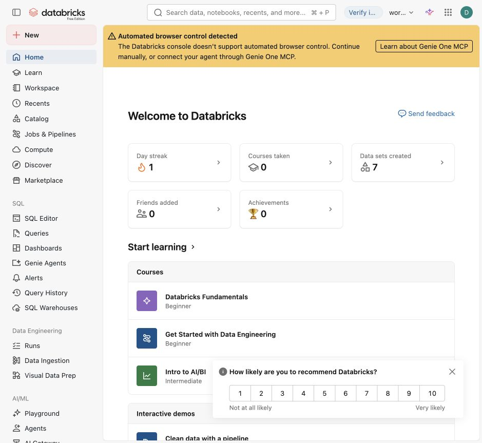

화면 1. 실습에서 사용할 홈 화면 · [원본 보기](images/runbook/00-workspace-home.jpg)

> **화면 기준:** Databricks Free Edition에서 직접 촬영한 화면을 사용합니다. 캡처의 계정 이메일과 리소스 ID는 촬영 환경의 값이며, 참가자는 본인 계정에서 실습합니다. 버튼 이름과 배치는 Workspace 버전에 따라 달라질 수 있습니다. 예상값과 실제 실행 결과는 그림 주변의 설명에서 구분합니다. 현재 캡처·검증 범위는 [강사용 확인표](02_screenshot_checklist.md)에 기록되어 있습니다.

- **Workspace**는 코드·노트북을 여는 곳입니다. **Catalog Explorer**는 테이블·Metric View·Volume을 확인하는 곳입니다.
- **Catalog → Schema → Table/Volume** 순으로 데이터가 정리됩니다. `cafe_training.cafe_hands_on.gold_sales`는 Catalog, Schema, Table 이름을 점으로 연결한 것입니다.
- `/Workspace/...`는 실습 코드 경로이고, `/Volumes/...`는 업로드한 데이터 파일 경로입니다. 서로 바꿔 입력하지 않습니다.
- `<사용자 이메일>`은 본인의 Databricks 로그인 이메일로 바꿉니다. 꺾쇠괄호까지 그대로 입력하지 않습니다.
- **SQL Warehouse**는 SQL을 실행하는 컴퓨팅 자원입니다. Python 노트북에는 Python 실행이 가능한 Compute를 연결합니다.
- **Pipeline**은 Bronze·Silver·Gold 데이터를 만드는 처리 흐름이고, **Job**은 Pipeline 실행과 검증 작업의 순서를 관리합니다.

### 실행할 파일 구분

| 파일 | 실행 위치와 방법 |
|---|---|
| `00_setup.sql`, `02_metric_view_baseline.sql`, `03_metric_view_optimized.sql` | Workspace 노트북에서 SQL Warehouse를 선택하고 `Run all` |
| `01_cafe_medallion_pipeline.sql` | 5절에서 Pipeline 소스로 등록하고 Pipeline 실행 |
| `04_pipeline_validate.sql` | 6절에서 Job의 SQL File task로 등록 |
| `05_create_ai_search.py`, `06_mlflow_monitoring.py` | Python Compute를 연결하고 안내된 셀 순서대로 실행 |

> **오류가 나면:** 실행한 파일·셀, 오류 메시지, 선택한 Compute를 확인합니다. 앞 단계가 실패했다면 다음 단계 실행을 멈추고 강사에게 해당 화면을 보여 주세요.

<a id="step-0"></a>

## 0. 고정 이름

| 대상 | 이름 또는 값 |
|---|---|
| GitHub repository | `https://github.com/juun0-han/dbx-cafe-hands-on.git` |
| Git branch | `main` |
| Git folder | `dbx-cafe-hands-on` |
| Catalog | `cafe_training` |
| Landing Schema | `cafe_landing` |
| Analytics Schema | `cafe_hands_on` |
| Volume | `cafe_training.cafe_landing.raw` |
| Pipeline | `cafe_medallion_pipeline` |
| Job | `cafe_medallion_job` |
| Pipeline task | `run_medallion_pipeline` |
| Validation task | `validate_pipeline` |
| Metric View | `cafe_training.cafe_hands_on.cafe_sales_metrics` |
| Genie Agent | `Cafe Sales Genie Agent` |

<a id="step-1"></a>

## 1. 사전 조건

참가자는 교육 전에 **본인 계정으로 Databricks Free Edition을 만들고 Workspace에 로그인**합니다. 실습 객체는 각자의 환경에 생성하므로, 모두 아래의 `cafe_training` 등 동일한 이름을 사용합니다. 로컬 폴더 이름을 Databricks Workspace 이름으로 입력할 필요는 없습니다.

본인 Workspace에서 다음 기능과 권한을 확인합니다.

- Unity Catalog 사용
- `cafe_training`에 대한 `USE CATALOG`
- Schema 생성 권한
- Volume 생성·업로드 권한
- SQL Warehouse 사용 권한
- Serverless Lakeflow Pipeline 사용 권한
- Gold 테이블 `SELECT`
- `cafe_hands_on` Schema `CREATE TABLE`
- Genie Agent 생성·편집 권한

Catalog는 3절의 setup 노트북에서 생성합니다. 생성 또는 실행이 실패하면 본인의 Free Edition Workspace에 로그인했는지 확인하고, 오류 메시지를 강사에게 보여 주세요. 13~16절의 심화 실습은 강사가 Free Edition에서 해당 기능과 모델을 사용할 수 있는지 사전 검증한 뒤 진행합니다.

<a id="step-2"></a>

## 2. GitHub 저장소를 Git folder로 받기

### Git folder 생성

Databricks Workspace에서 다음 메뉴를 선택합니다.

`Workspace → Home(개인 폴더) → Create → Git folder`

개인 폴더 우측 위 **Create → Git folder**를 선택합니다.


화면 2. Git folder 생성 메뉴 · [원본 보기](images/runbook/01-create-menu.jpg)

입력값:

| 항목 | 값 |
|---|---|
| Git repository URL | https://github.com/juun0-han/dbx-cafe-hands-on.git |
| Provider | GitHub |
| Git folder name | dbx-cafe-hands-on |

위 값을 입력한 뒤 **Create Git folder**를 누릅니다. 생성 후 브랜치가 `main`인지 확인합니다.


화면 3. 저장소 연결 정보 · [원본 보기](images/runbook/02-create-git-folder.jpg)

생성된 폴더는 다음 형식입니다.

```text
/Workspace/Users/<사용자 이메일>/dbx-cafe-hands-on
```

다음 구조가 보여야 합니다.

- `README.md`
- `databricks.yml`
- `docs/`
- `notebooks/`
- `resources/`
- `sample_data/`

폴더 이름 옆 **main**과 `docs`, `notebooks`, `resources`, `sample_data`를 확인합니다. Databricks에서는 노트북의 `.sql`·`.py` 확장자가 생략되어 보일 수 있습니다.


화면 4. Clone 완료와 main 브랜치 · [원본 보기](images/runbook/03-git-folder-ready.jpg)

### 2-1. 먼저 열어볼 문서

Git folder를 만든 직후 다음 가이드부터 엽니다.

`docs/01_hands_on_runbook.md`

함께 확인할 문서:

- `README.md`
- `docs/00_start_here.md`
- `HANDS_ON_SESSION_DESIGN.md`

`docs/01_hands_on_runbook.md`에는 현재 실습에 사용하는 이름, 경로, 화면 입력값, 검증값이 모두 정리되어 있습니다.
Git folder clone이나 GitHub ZIP 다운로드에 이 파일이 포함되어 있는지 확인하고, 실습 중에는 이 문서를 함께 열어 둡니다.

### 2-2. 로컬 PC로 파일 내려받기

Volume 업로드 화면은 로컬 파일을 선택하므로, 다음 방법 중 하나로 저장소 파일을 로컬 PC에 준비합니다.

방법 A: GitHub 저장소 화면에서 `Code > Download ZIP`을 선택한 뒤 압축을 해제합니다.

방법 B: GitHub 저장소를 로컬 PC에 clone합니다.

```powershell
git clone https://github.com/juun0-han/dbx-cafe-hands-on.git
```

Git folder 안의 문서·노트북은 Workspace에서 직접 열어도 됩니다. 로컬 다운로드는 아래 Volume 업로드 파일과 Excel·CSV 참고 파일을 확인할 때 사용합니다.

### 2-3. 이후 Volume에 업로드할 파일 확인

다음 6개 파일을 이후 3장에서 Volume에 업로드합니다.

- `sample_data/raw/stores.csv`
- `sample_data/raw/products.csv`
- `sample_data/raw/orders/orders_batch_001.csv`
- `sample_data/raw/orders/orders_batch_002.csv`
- `sample_data/raw/orders/orders_batch_003.csv`
- `sample_data/support/glossary.csv`


### 2-4. 실습 중 열어볼 참고 파일

<details>
<summary>전체 참고 파일 목록 펼치기</summary>

| 시점 | 열어볼 파일 | 용도 |
|---|---|---|
| 시작 | `docs/01_hands_on_runbook.md` | 전체 실행 절차 |
| 시작 | `docs/00_start_here.md` | Catalog·Schema·Volume 준비 |
| 시작 | `README.md` | 저장소 구조와 실행 순서 |
| Pipeline | `notebooks/01_cafe_medallion_pipeline.sql` | Bronze·Silver·Gold 소스 확인 |
| Pipeline 검증 | `notebooks/04_pipeline_validate.sql` | Job 검증 SQL 확인 |
| 기대값 확인 | `sample_data/support/expected_results.csv` | 행 수와 지표 기대값 확인 |
| 데이터 설명 | `sample_data/support/data_dictionary.csv` | 컬럼과 업무 의미 확인 |
| Metric View | `notebooks/02_metric_view_baseline.sql` | 기준선 정의 확인 |
| Metric View | `notebooks/03_metric_view_optimized.sql` | 설명·동의어·포맷 확인 |
| Genie 지침 | `resources/genie_instructions.md` | 일반 지침 입력 |
| Genie 질문 | `resources/genie_questions.md` | 기본·분석·다의어 질문 |
| Genie 예제 | `sample_data/support/genie_example_queries.csv` | Example Query 입력 SQL |
| Genie 평가 | `sample_data/support/genie_benchmarks.csv` | Benchmark 질문과 정답 |
| AI Search | `sample_data/support/glossary.csv` | 용어집 원본 |
| Agent 평가 | `sample_data/support/agent_evaluation.csv` | Agent 평가 질문 |
| Apps | `resources/supervisor_prompt.md` | Supervisor 지침 |
| Apps | `resources/app.yaml.example` | App 설정 예시 |
| Apps | `resources/app_resource_binding.example.yml` | App 리소스 연결 예시 |
| MLflow | `notebooks/06_mlflow_monitoring.py` | Trace·평가 확인 |

</details>

### 2-5. Excel 파일 사용

다음 Excel 파일은 참고용이며 Volume에 업로드하지 않습니다.

- `cafe_hands_on_assets.xlsx`
- `cafe_sample_data_review.xlsx`

Excel에서는 샘플 데이터, 데이터 사전, 기대 결과, Genie 질문·Benchmark 구성을 한눈에 확인할 수 있습니다. 실행 중 값이 예상과 다를 때 `expected_results.csv`와 함께 확인합니다.

<a id="step-3"></a>

## 3. Catalog, Schema, Volume 준비

### 3-1. SQL Warehouse 연결

Git folder에서 다음 파일을 열고 SQL Warehouse를 연결합니다.

`notebooks/00_setup.sql`

1. 노트북 상단 Compute 버튼이 `Serverless`이면 **Serverless → More… → SQL Warehouse**를 선택합니다.
2. 교육용 Warehouse를 고릅니다. 이 Workspace의 이름은 `Serverless Starter Warehouse`입니다.
3. **SQL Warehouse** 선택과 Warehouse 이름을 확인한 뒤 **Start and attach**(이미 실행 중이면 **Attach**)를 누릅니다.

아래 그림은 **SQL Warehouse를 선택한 뒤 나타나는 연결 창**입니다. `Serverless → More… 메뉴를 여셨을 때 보여집니다.


화면 5. SQL Warehouse 연결 · [원본 보기](images/runbook/04-attach-warehouse.jpg)

### 3-2. Setup 실행

상단에 Warehouse 이름이 표시되면 **Run all**로 실행합니다. 개별 셀 왼쪽의 실행 버튼과 전체 실행 버튼을 구분하세요.


화면 6. Setup 노트북 전체 실행 · [원본 보기](images/runbook/05-setup-run-all.jpg)

### 3-3. 생성 객체 확인

생성 객체:

- `cafe_training.cafe_landing`
- `cafe_training.cafe_hands_on`
- `cafe_training.cafe_landing.raw`

Catalog Explorer에서 다음 구조를 확인합니다.

```text
cafe_training
├── cafe_landing
│   └── Volumes
│       └── raw
└── cafe_hands_on
```

왼쪽에서 **cafe_training → cafe_landing → Volumes → raw**를 엽니다. 생성 직후에는 파일 목록이 비어 있습니다.


화면 7. raw Volume 위치 · [원본 보기](images/runbook/06-volume.jpg)

<a id="step-4"></a>

## 4. CSV를 Volume에 업로드

**이동:** Catalog → cafe_training → cafe_landing → Volumes → raw

### 4-1. 업로드할 디렉터리 만들기

`raw` Volume의 **Create directory**로 `orders`를 만듭니다. 파일 목록 위 경로에서 `raw`로 돌아온 뒤, 같은 방법으로 `support`를 만듭니다.


화면 8. 디렉터리 생성 · [원본 보기](images/runbook/08-create-directory.jpg)

**완료 확인:** `orders`와 `support`가 모두 `raw` 바로 아래에 있습니다.

### 4-2. 매장·상품 파일 업로드

`raw`에서 **Upload to this volume → browse → Select files**를 선택합니다. 아래 두 파일을 고르고 **Destination volume**을 확인한 뒤 **Upload**를 누릅니다.

| 항목 | 값 |
|---|---|
| 로컬 폴더 | `sample_data/raw/` |
| 선택할 파일 | `stores.csv`, `products.csv` |

**업로드 목적지**

```text
/Volumes/cafe_training/cafe_landing/raw
```


화면 9. 매장·상품 업로드 · [원본 보기](images/runbook/07-upload-root.jpg)

**완료 확인:** `raw`에 `stores.csv`, `products.csv`가 보입니다.

### 4-3. 주문 배치 세 개 업로드

`orders` 디렉터리를 열고 같은 방법으로 아래 세 파일을 업로드합니다. 목적지 끝이 **orders**인지 확인합니다.

| 항목 | 값 |
|---|---|
| 로컬 폴더 | `sample_data/raw/orders/` |
| 선택할 파일 | `orders_batch_001.csv`, `orders_batch_002.csv`, `orders_batch_003.csv` |

**업로드 목적지**

```text
/Volumes/cafe_training/cafe_landing/raw/orders
```


화면 10. 주문 배치 업로드 · [원본 보기](images/runbook/09-upload-orders.jpg)

**완료 확인:** `orders` 안에 주문 배치 CSV 세 개가 보입니다.

### 4-4. 용어집 업로드

`raw`로 돌아온 뒤 `support` 디렉터리를 엽니다. `sample_data/support/glossary.csv`를 선택하고 목적지 끝이 **support**인지 확인한 뒤 업로드합니다.

**업로드 목적지**

```text
/Volumes/cafe_training/cafe_landing/raw/support
```


화면 11. 용어집 업로드 · [원본 보기](images/runbook/10-upload-glossary.jpg)

**완료 확인:** `support` 안에 `glossary.csv`가 보입니다.

### 4-5. 최종 파일 구조 확인

`raw`로 돌아가 아래 구조와 비교합니다. 업로드 요약이 표시되어 있다면 **6 files uploaded**도 확인합니다.


화면 12. Volume 업로드 완료 · [원본 보기](images/runbook/11-volume-ready.jpg)

```text
raw/
├── stores.csv
├── products.csv
├── orders/
│   ├── orders_batch_001.csv
│   ├── orders_batch_002.csv
│   └── orders_batch_003.csv
└── support/
    └── glossary.csv
```

> **완료 확인:** 루트에 CSV 두 개, `orders`에 세 개, `support`에 한 개로 총 6개입니다.

---

**데이터 파이프라인 · 5~6절**

<a id="step-5"></a>

## 5. Lakeflow Pipeline 생성

`01_cafe_medallion_pipeline.sql`은 Pipeline 전용 소스입니다. 3절의 setup 노트북처럼 SQL Warehouse에서 `Run all`하지 말고, 아래에서 Pipeline에 연결합니다.

다음 메뉴를 선택합니다.

`Jobs & Pipelines → ETL pipeline`

**ETL pipeline**은 데이터 변환용이고, **Job**은 6절에서 실행 순서를 만드는 메뉴입니다.

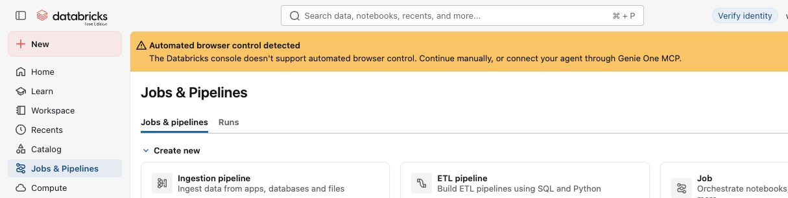

화면 13. ETL pipeline 진입 메뉴 · [원본 보기](images/runbook/12-jobs-entry.jpg)

현재 UI에서는 `ETL pipeline`을 누르면 기본 Pipeline과 빈 소스 파일이 생성됩니다. 상단 Pipeline 이름을 `cafe_medallion_pipeline`으로 바꾸고 Enter를 누릅니다. **Settings**에서 설정합니다. 이 가이드의 소스 파일 선택 화면은 Settings 하단의 **Legacy pipeline settings**에서 촬영했습니다.

Code assets와 Default location for data assets를 확인합니다. 패널을 아래로 스크롤하면 나타나는 **Legacy pipeline settings**는 기존 폼으로 설정하는 진입점입니다(이 캡처 범위 밖).

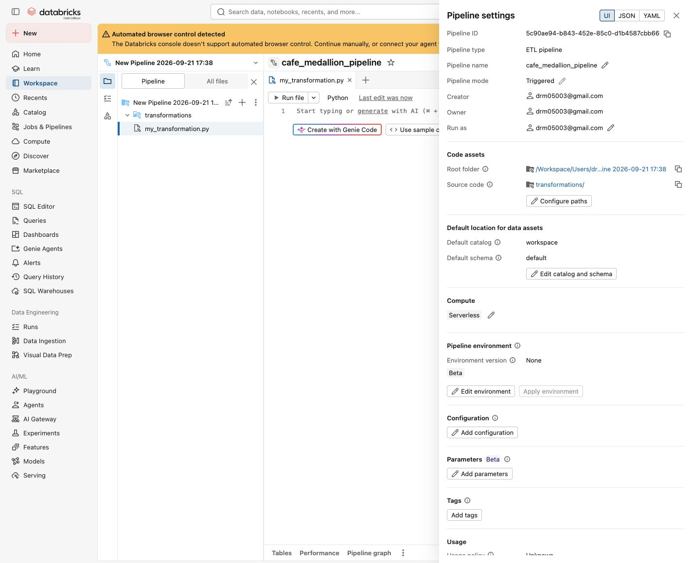

화면 14. Pipeline 설정 · [원본 보기](images/runbook/13-pipeline-settings-entry.jpg)

Pipeline 설정:

| 항목 | 값 |
|---|---|
| Pipeline name | cafe_medallion_pipeline |
| Source file | notebooks/01_cafe_medallion_pipeline.sql |
| Catalog | cafe_training |
| Schema | cafe_hands_on |
| Serverless | On |
| Product edition | Advanced |
| Channel | Current (UI가 Default Storage에 대해 Preview를 요구하면 Preview) |
| Pipeline mode | Triggered |

Source가 폴더 단위로 표시되면 다음 폴더에서 `01_cafe_medallion_pipeline.sql`을 선택합니다.

```text
/Workspace/Users/<사용자 이메일>/dbx-cafe-hands-on/notebooks
```

**01_cafe_medallion_pipeline** 하나를 선택합니다. `notebooks` 전체를 소스로 지정하면 setup·Metric View·검증 파일까지 함께 실행될 수 있으므로 파일을 지정하세요.

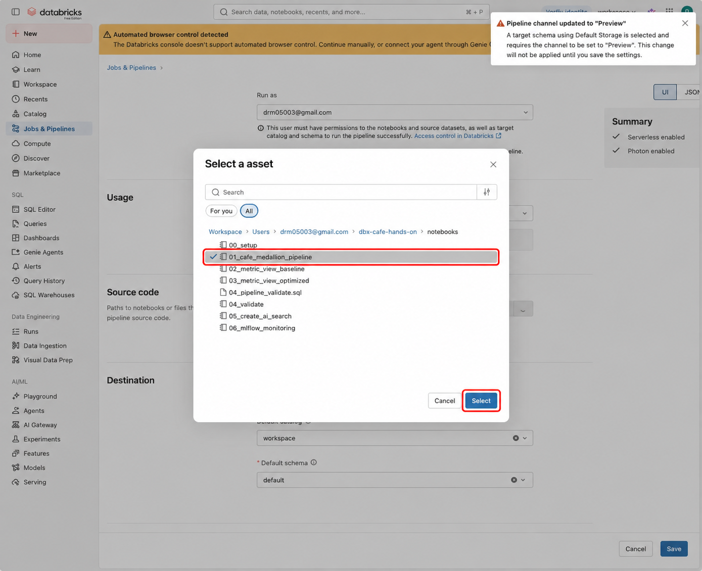

화면 15. Pipeline 소스 선택 · [원본 보기](images/runbook/14-pipeline-source.jpg)

Source code의 **Path**, Destination의 **cafe_training / cafe_hands_on**을 확인하고 **Save**합니다. 이 Workspace는 Default Storage를 사용해 Channel이 **Preview**로 고정됩니다. Advanced edition 선택란이 없는 Serverless UI에서는 해당 항목을 별도로 찾지 않습니다.

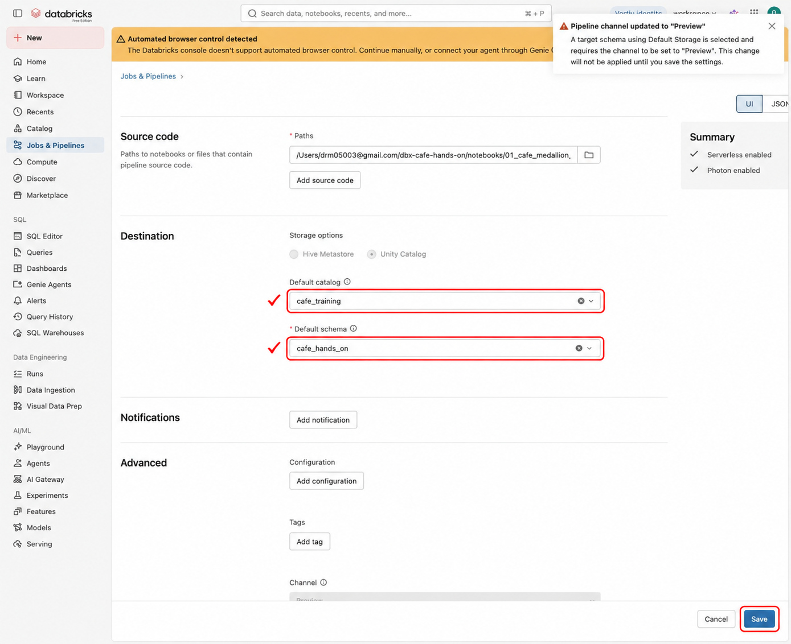

화면 16. 소스 경로와 출력 위치 · [원본 보기](images/runbook/15-pipeline-settings.jpg)

초기 생성된 `transformations/**` 경로를 위의 실습 노트북 경로로 교체합니다. 저장 후 **Run pipeline**을 클릭합니다.

생성 데이터셋:

- bronze_stores, bronze_products, bronze_orders
- silver_stores, silver_products, silver_orders_clean
- gold_sales

실제 실행에서 **Completed**, 7개 데이터셋의 성공 표시, `bronze_orders` 300행과 `gold_sales` 266행을 확인했습니다. 초록색 DAG만 보지 말고 아래 Tables의 Output records도 확인합니다.

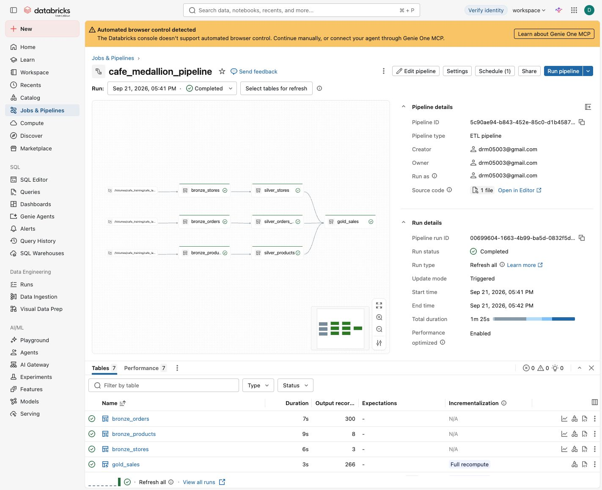

화면 17. Pipeline 실행 결과 · [원본 보기](images/runbook/19-pipeline-completed.jpg)

모든 노드가 성공하면 Catalog Explorer에서 `cafe_training.cafe_hands_on`의 위 테이블을 확인합니다.

<a id="step-6"></a>

## 6. Lakeflow Job 생성

다음 메뉴를 선택합니다.

`Jobs & Pipelines → Job`

**Job 이름:** `cafe_medallion_job`

상단의 자동 생성된 Job 이름을 클릭해 `cafe_medallion_job`으로 바꾸고 Enter를 누릅니다. 첫 화면의 **Add another task type → ETL Pipeline**으로 첫 Task를 추가합니다.

### 6-1. Pipeline 실행 Task

| 항목 | 값 |
|---|---|
| Task name | run_medallion_pipeline |
| Task type | Pipeline |
| Pipeline | cafe_medallion_pipeline |
| Full refresh | Off |

**Task name**, **Pipeline**을 확인하고 **Trigger a full refresh**는 체크하지 않습니다. **Save task**를 누릅니다.

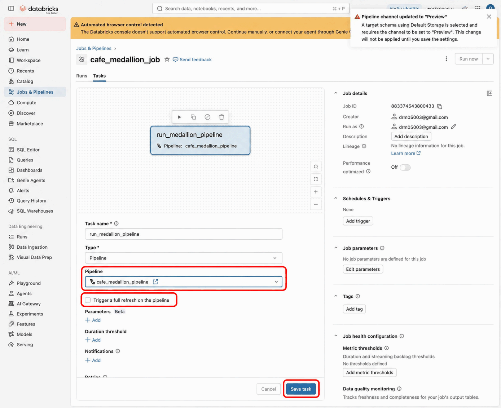

화면 18. Pipeline 실행 Task · [원본 보기](images/runbook/16-job-pipeline-task.jpg)

### 6-2. Pipeline 검증 Task

**Add task → SQL file**을 선택한 뒤 다음을 입력합니다. 생성 메뉴에서는 **SQL file**로 표시되고, 저장 후 편집 화면에서는 **Type = SQL / SQL task = File**로 표시됩니다.

| 항목 | 값 |
|---|---|
| Task name | validate_pipeline |
| Task type | SQL file |
| SQL Warehouse | 앞 단계에서 사용한 SQL Warehouse |

**SQL 파일:** `notebooks/04_pipeline_validate.sql`

Workspace Source인 경우:

```text
/Workspace/Users/<사용자 이메일>/dbx-cafe-hands-on/notebooks/04_pipeline_validate.sql
```

Git provider Source인 경우:

| 항목 | 값 |
|---|---|
| Repository | https://github.com/juun0-han/dbx-cafe-hands-on.git |
| Branch | main |
| Path | notebooks/04_pipeline_validate.sql |

**Users → 본인 계정 → dbx-cafe-hands-on → notebooks → 04_pipeline_validate.sql**을 선택하고 **Confirm**합니다.

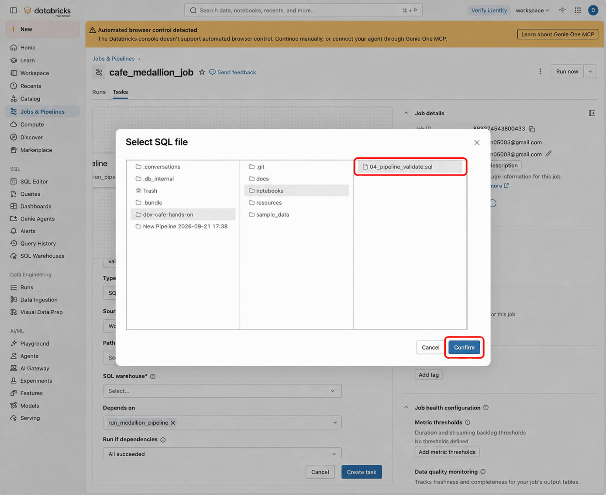

화면 19. 검증 SQL 파일 선택 · [원본 보기](images/runbook/17-job-sql-file.jpg)

**SQL warehouse**, **Depends on = run_medallion_pipeline**, **Run if dependencies = All succeeded**를 확인한 뒤 **Create task**를 누릅니다.

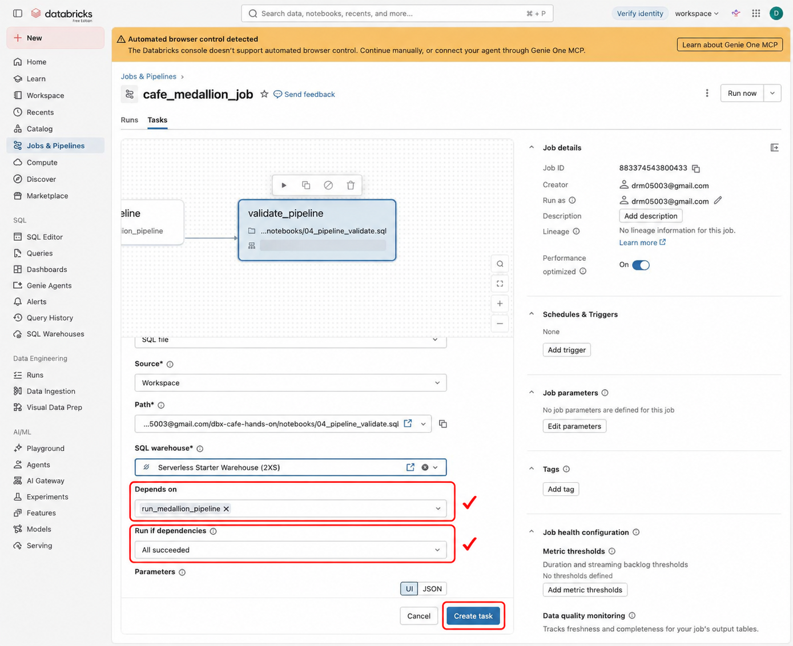

화면 20. 검증 Task 설정 · [원본 보기](images/runbook/18-job-validation-task.jpg)

`validate_pipeline`의 Dependency:

`Depends on: run_medallion_pipeline`

Job DAG:

```text
run_medallion_pipeline
          ↓
   validate_pipeline
```

### 6-3. Job 실행과 결과 확인

`Save` 후 `Run now`를 클릭합니다. 예상 결과:

| 테이블 | 실제 | 기대 | 결과 |
|---|---:|---:|---|
| bronze_orders | 300 | 300 | PASS |
| silver_orders_clean | 296 | 296 | PASS |
| gold_sales | 266 | 266 | PASS |

> **주의:** Job 상태가 성공이어도 결과 표의 세 행이 모두 `PASS`인지 확인합니다. 제공된 검증 SQL은 값이 다르면 `FAIL`을 표시하지만, 그 자체로 SQL 실행 오류를 발생시키지는 않습니다.

**완료 확인:** 두 Task가 모두 **Succeeded**인지 확인한 뒤, 검증 Task를 열어 결과 표를 확인합니다.

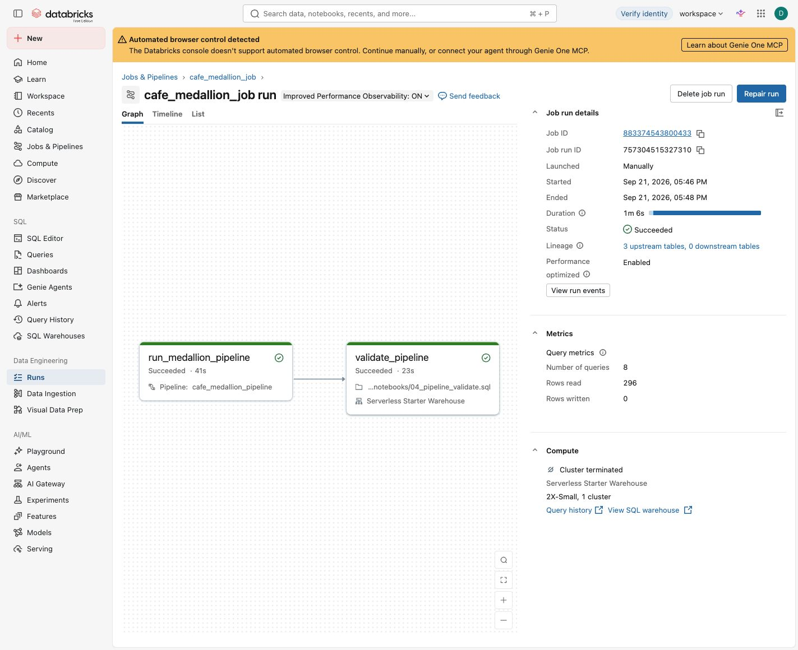

화면 21. Job 실행 결과 · [원본 보기](images/runbook/28-job-succeeded.jpg)

참고: 실제 실행에서는 Pipeline Task 41초, 검증 Task 23초가 걸렸으며 소요 시간은 환경에 따라 달라집니다.

**완료 확인:** 실제 검증 결과는 **bronze_orders = 300**, **silver_orders_clean = 296**, **gold_sales = 266**이고 모두 **PASS**입니다. 행 순서는 달라질 수 있습니다.

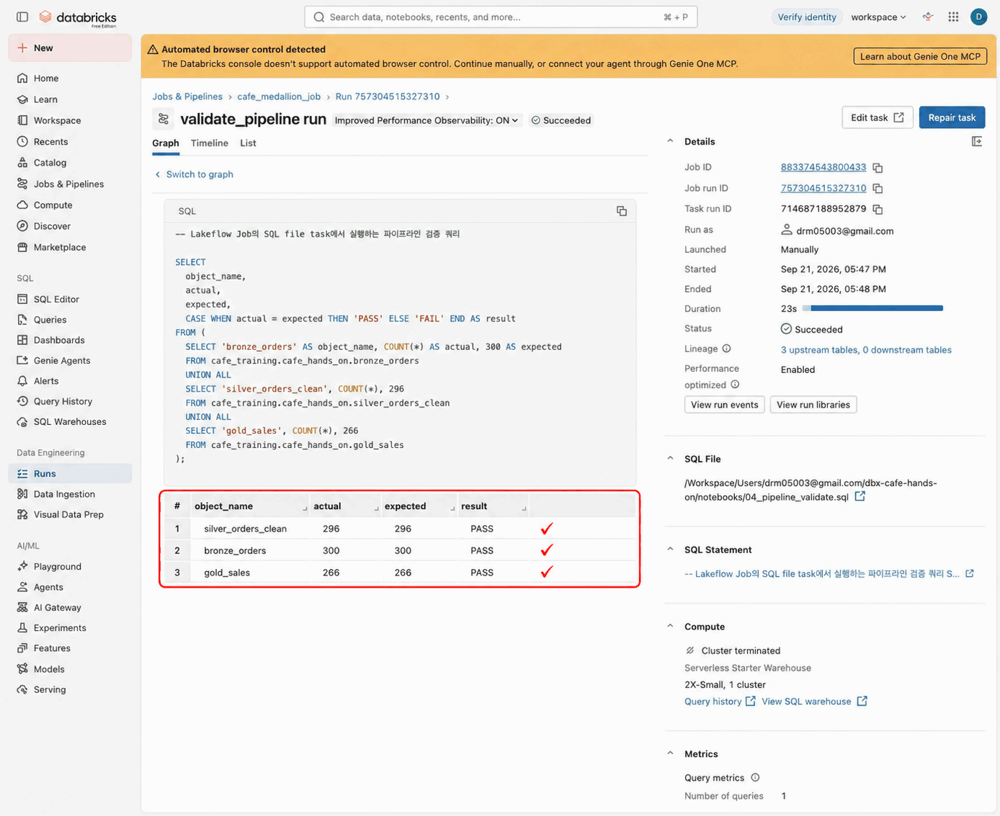

화면 22. 행 수 검증 결과 · [원본 보기](images/runbook/29-validation-pass.jpg)

---

**매출 지표와 자연어 분석 · 7~12절**

<a id="step-7"></a>

## 7. Metric View 기준선 생성

다음 파일을 SQL Warehouse에서 `Run all`합니다.

`notebooks/02_metric_view_baseline.sql`

**생성 객체:** `cafe_training.cafe_hands_on.cafe_sales_metrics`

마지막 쿼리의 예상값:

| 항목 | 값 |
|---|---|
| net_sales | 1,734,580 |
| order_count | 266 |
| avg_order_value | 약 6,520.98 |

**02_metric_view_baseline**을 열고 SQL Warehouse를 확인한 뒤 **Run all**을 누릅니다. Warehouse가 정지 상태라면 **Start, attach and run**을 선택합니다.

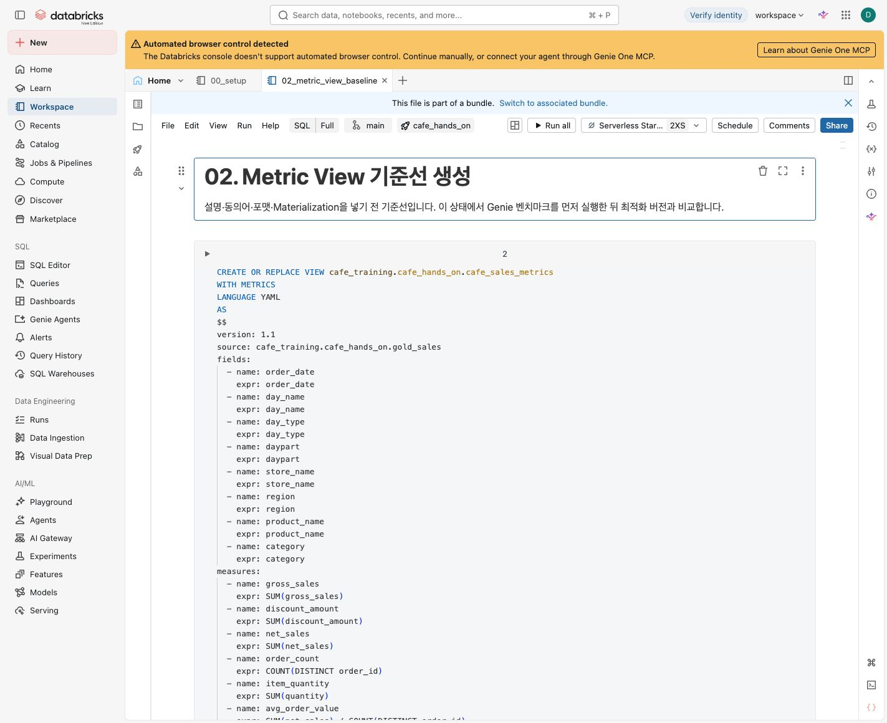

화면 23. Metric View 기준선 실행 · [원본 보기](images/runbook/20-metric-baseline.jpg)

마지막 SELECT의 실제 결과가 **1734580 / 266 / 6520.977443609023**인지 확인합니다. CREATE 문 뒤의 `No rows returned`는 오류가 아닙니다.

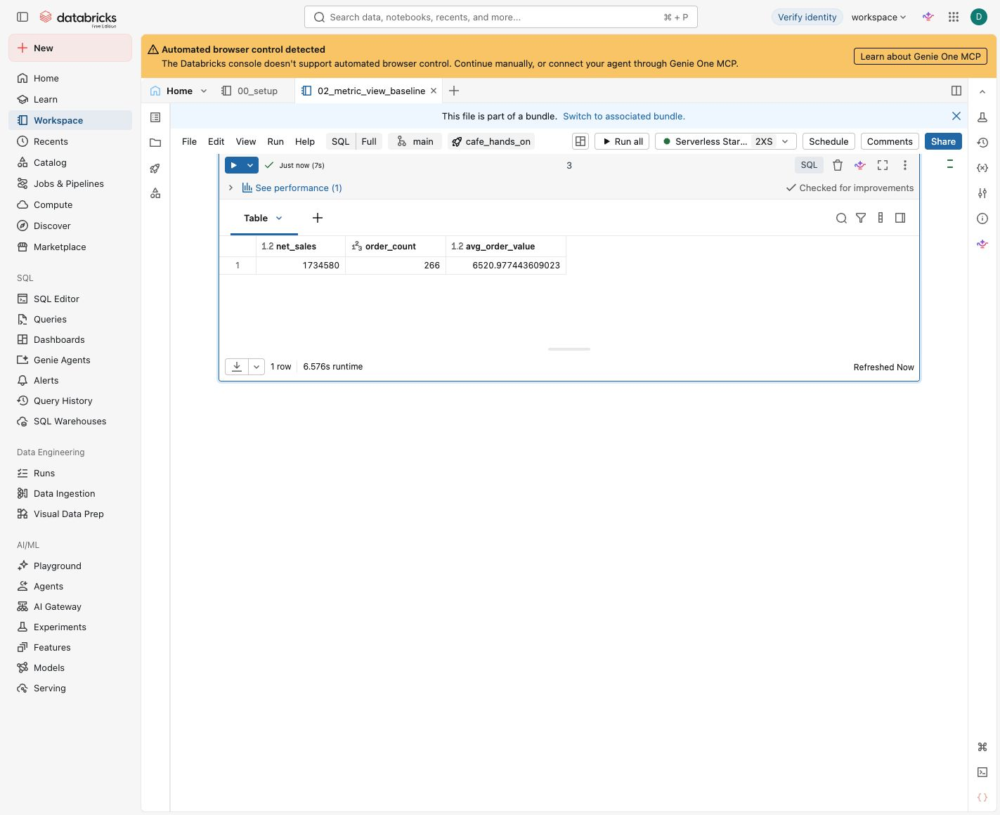

화면 24. 기준선 지표 조회 결과 · [원본 보기](images/runbook/21-metric-baseline-result.jpg)

<a id="step-8"></a>

## 8. Metric View 최적화 정의 적용

다음 파일을 같은 SQL Warehouse에서 `Run all`합니다.

`notebooks/03_metric_view_optimized.sql`

**03_metric_view_optimized**에서 같은 Warehouse로 실행합니다. 표시명·동의어·포맷을 정의하는 SQL입니다.

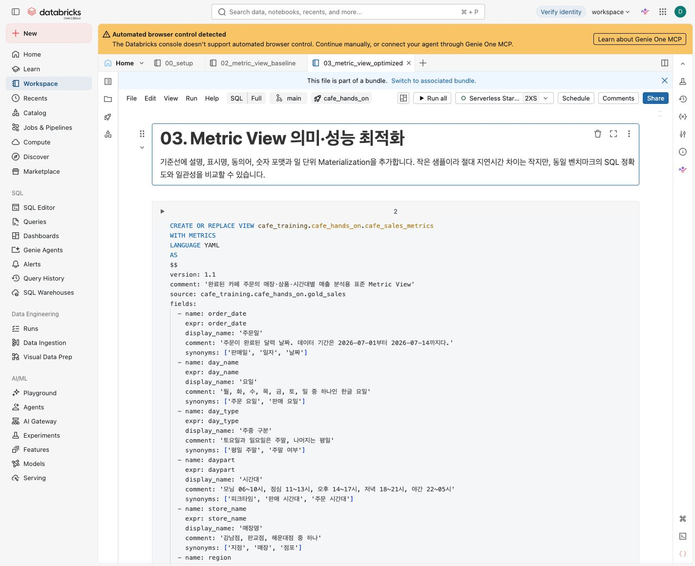

화면 25. Metric View 최적화 실행 · [원본 보기](images/runbook/22-metric-optimized.jpg)

적용되는 메타데이터:

| 항목 | 값 |
|---|---|
| 표시명 | 순매출, 주문수, 판매수량, 객단가 |
| 동의어 | 매출, 실매출, 결제매출, 판매액 등 |
| 포맷 | 매출·객단가 KRW, 주문수·판매수량 정수 |
| Materialization | daily_store_category, 하루 1회 |

최적화 후에는 아래 **조회문만** 새 SQL 셀에서 실행하여 값이 유지되는지 확인합니다.

> **주의:** 기준선 노트북을 다시 `Run all`하면 최적화 정의를 기준선 정의로 덮어씁니다.

```sql
SELECT MEASURE(net_sales) AS net_sales,
       MEASURE(order_count) AS order_count,
       MEASURE(avg_order_value) AS avg_order_value
FROM cafe_training.cafe_hands_on.cafe_sales_metrics;
```

예상값은 `net_sales=1,734,580`, `order_count=266`, `avg_order_value=약 6,520.98`입니다.

<a id="step-9"></a>

## 9. Genie Agent 생성

다음 메뉴를 선택합니다.

`Genie Agents → New`

**Agent 이름:** `Cafe Sales Genie Agent`

데이터 자산에는 다음 Metric View 하나만 추가합니다.

`cafe_training.cafe_hands_on.cafe_sales_metrics`

**Connect your data**에서 `cafe_sales_metrics`를 검색합니다. 소속이 **cafe_training.cafe_hands_on**인 Metric View 하나만 선택하고 **Create**를 누릅니다.

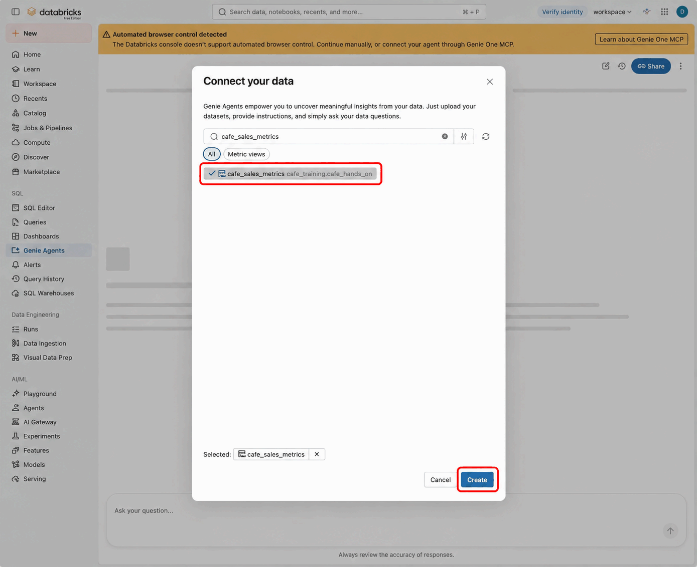

화면 26. Genie 연결 자산 선택 · [원본 보기](images/runbook/23-genie-select-metric-view.jpg)

생성 후 이름이 자동으로 정해졌다면 **Configure → About → About this agent의 연필 아이콘**에서 이름을 수정합니다. Default warehouse는 실습에 사용한 SQL Warehouse로 지정합니다.

**Name = Cafe Sales Genie Agent**, **Default warehouse = Serverless Starter Warehouse**를 확인하고 **Save**를 누릅니다. Owner와 Agent ID는 각자의 환경에서 자동 지정됩니다.

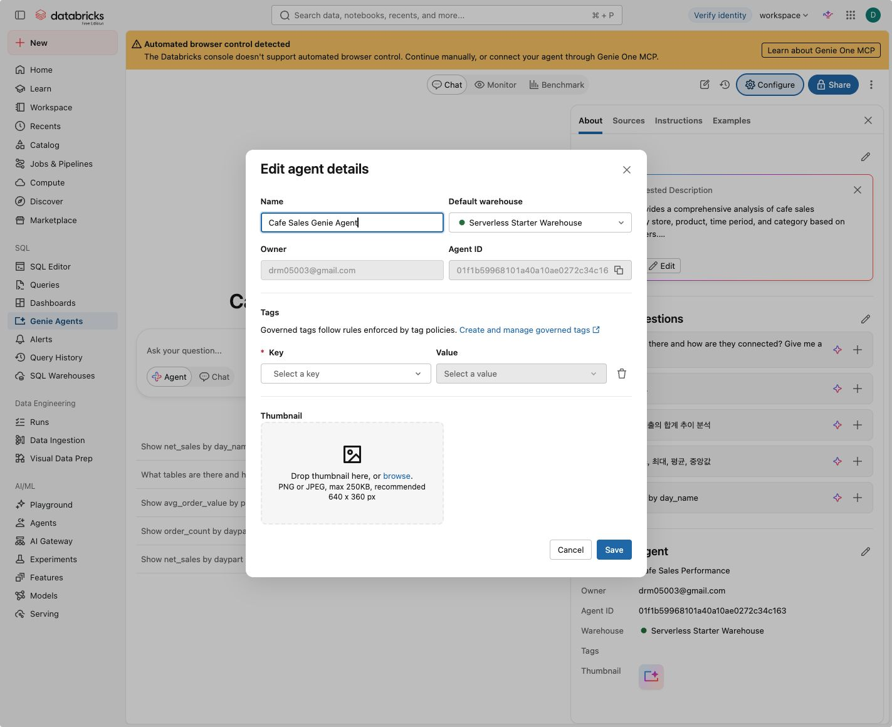

화면 27. Genie 이름과 Warehouse · [원본 보기](images/runbook/24-genie-name.jpg)

`Configure > Instructions`의 입력값입니다. 구버전 화면에서는 `Configure > Context > Instructions`로 표시될 수 있습니다. [genie_instructions.md](../resources/genie_instructions.md)의 전체 내용을 붙여 넣고 **Save**를 누릅니다.

오른쪽 **Instructions**에 지침을 입력한 상태입니다. 아래 **Save**를 누른 뒤 다른 탭으로 이동했다 돌아와도 내용이 유지되는지 확인합니다.

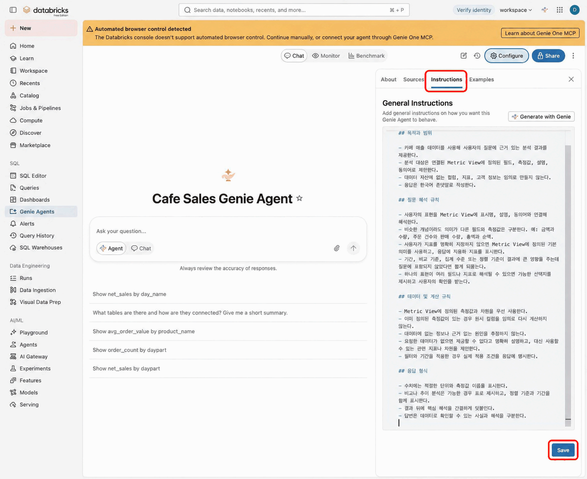

화면 28. Genie 지침 입력 · [원본 보기](images/runbook/25-genie-instructions.jpg)

<details>
<summary>복사용 Genie 지침 전문 펼치기</summary>

```text
# 카페 매출 Genie Agent 지침

## 목적과 범위

- 카페 매출 데이터를 사용해 사용자의 질문에 근거 있는 분석 결과를 제공한다.
- 분석 대상은 연결된 Metric View에 정의된 필드, 측정값, 설명, 동의어로 제한한다.
- 데이터 자산에 없는 컬럼, 지표, 고객 정보는 임의로 만들지 않는다.
- 응답은 한국어 존댓말로 작성한다.

## 질문 해석 규칙

- 사용자의 표현을 Metric View의 표시명, 설명, 동의어와 연결해 해석한다.
- 비슷한 개념이라도 의미가 다른 필드와 측정값은 구분한다. 예: 금액과 수량, 주문 건수와 판매 수량, 총액과 순액.
- 사용자가 지표를 명확히 지정하지 않으면 Metric View에 정의된 기본 의미를 사용하고, 응답에 적용한 지표를 표시한다.
- 기간, 비교 기준, 집계 수준 또는 정렬 기준이 결과에 큰 영향을 주는데 질문에 포함되지 않았다면 짧게 되묻는다.
- 하나의 표현이 여러 필드나 지표로 해석될 수 있으면 가능한 선택지를 제시하고 사용자의 확인을 받는다.

## 데이터 및 계산 규칙

- Metric View에 정의된 측정값과 차원을 우선 사용한다.
- 이미 정의된 측정값이 있는 경우 원시 컬럼을 임의로 다시 계산하지 않는다.
- 데이터에 없는 정보나 근거 없는 원인을 추정하지 않는다.
- 요청한 데이터가 없으면 제공할 수 없다고 명확히 설명하고, 대신 사용할 수 있는 관련 지표나 차원을 제안한다.
- 필터와 기간을 적용한 경우 실제 적용 조건을 응답에 명시한다.

## 응답 형식

- 수치에는 적절한 단위와 측정값 이름을 표시한다.
- 비교나 추이 분석은 가능한 경우 표로 제시하고, 정렬 기준과 기간을 함께 표시한다.
- 결과 뒤에 핵심 해석을 간결하게 덧붙인다.
- 답변은 데이터로 확인할 수 있는 사실과 해석을 구분한다.
```

</details>

<a id="step-10"></a>

## 10. Genie Example Query 등록

**Configure → Examples → Add**에서 예제를 추가합니다. 구버전 화면에서는 `Configure > Context > Add`로 표시될 수 있습니다.

**Examples** 탭 오른쪽 위 **Add**가 예제 등록의 진입점입니다. 이 캡처는 등록 전 상태로 **All (0)**입니다. 아래 6개를 저장한 뒤 실제 목록에서 확인합니다.

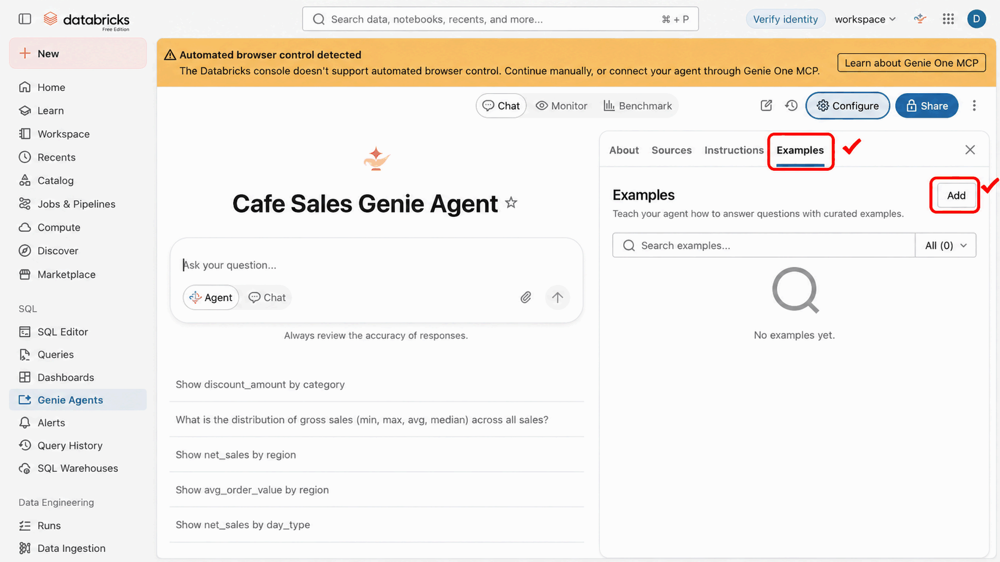

화면 29. 예제 등록 메뉴 · [원본 보기](images/runbook/26-genie-examples.jpg)

추가 항목의 이름은 Workspace 버전에 따라 다를 수 있습니다. 현재는 **Example Query**만 선택합니다.

| 메뉴 | 현재 단계 | 용도 |
|---|---|---|
| Example Query | 사용 | 질문과 정답 SQL 등록 |
| Filter | 사용하지 않음 | 재사용 필터 조건 |
| Measure | 사용하지 않음 | 별도 지표 계산식 |
| Field | 사용하지 않음 | 컬럼 설명·동의어 |
| Join | 사용하지 않음 | 여러 데이터 자산 관계 |

다음 파일의 6개 항목을 Example Query로 등록합니다.

`sample_data/support/genie_example_queries.csv`

각 항목의 `Question`과 `SQL`을 하나의 Example Query로 입력합니다.

### E001 · 전체 기간 순매출

**Question:** `전체 기간 순매출은 얼마야?`

SQL:

```sql
SELECT MEASURE(net_sales) AS net_sales
FROM cafe_training.cafe_hands_on.cafe_sales_metrics;
```

### E002 · 매장별 순매출

**Question:** `매장별 순매출을 비교해줘`

SQL:

```sql
SELECT store_name,
       MEASURE(net_sales) AS net_sales
FROM cafe_training.cafe_hands_on.cafe_sales_metrics
GROUP BY store_name
ORDER BY net_sales DESC;
```

### E003 · 판매수량 TOP 3

**Question:** `판매수량 기준 TOP 3 메뉴는?`

SQL:

```sql
SELECT product_name,
       MEASURE(item_quantity) AS item_quantity
FROM cafe_training.cafe_hands_on.cafe_sales_metrics
GROUP BY product_name
ORDER BY item_quantity DESC
LIMIT 3;
```

### E004 · 일자별 순매출

**Question:** `일자별 순매출 추이를 보여줘`

SQL:

```sql
SELECT order_date,
       MEASURE(net_sales) AS net_sales
FROM cafe_training.cafe_hands_on.cafe_sales_metrics
GROUP BY order_date
ORDER BY order_date;
```

### E005 · 시간대별 순매출과 주문수

**Question:** `시간대별 순매출과 주문수를 비교해줘`

SQL:

```sql
SELECT daypart,
       MEASURE(net_sales) AS net_sales,
       MEASURE(order_count) AS order_count
FROM cafe_training.cafe_hands_on.cafe_sales_metrics
GROUP BY daypart
ORDER BY net_sales DESC;
```

### E006 · 매장별 객단가

**Question:** `매장별 객단가가 높은 순서로 보여줘`

SQL:

```sql
SELECT store_name,
       MEASURE(avg_order_value) AS avg_order_value
FROM cafe_training.cafe_hands_on.cafe_sales_metrics
GROUP BY store_name
ORDER BY avg_order_value DESC;
```

채팅 화면에서 다음 질문을 테스트합니다.

`전체 기간 순매출은 얼마야?`

**예상 결과:** `순매출 약 1,734,580원`

다음 질문은 바로 SQL을 실행하지 않고 되물어야 합니다.

- 인기메뉴가 뭐야?
- 라떼 매출 알려줘.
- 손님이 가장 많은 매장은 어디야?

예상 동작:

| 질문·용어 | 예상 동작 |
|---|---|
| 인기메뉴 | 매출 기준인지 판매수량 기준인지 질문 |
| 라떼 | 카페라떼인지 바닐라라떼인지 질문 |
| 손님 | 고객 데이터가 없음을 설명하고 주문수 또는 판매수량을 질문 |

<a id="step-11"></a>

## 11. Genie Benchmark 등록 및 실행

Benchmark는 Genie Agent의 답변 정확도를 반복 측정하기 위한 테스트 질문 모음입니다. Chat 모드는 등록된 SQL Answer의 결과셋과 Genie 결과를 비교하고, Agent 모드는 Evaluation note를 기준으로 평가합니다. 실행할 때 `Chat` 또는 `Agent` 모드를 선택합니다.

### 11-1. Benchmark 입력 파일

`sample_data/support/genie_benchmarks.csv`

파일의 열은 다음과 같습니다.

`benchmark_id, mode, category, question, sql_answer, evaluation_note, expected_behavior`

### 11-2. Benchmark 추가

다음 메뉴를 선택합니다.

`Cafe Sales Genie Agent → Benchmark → Add benchmark`

Chat 모드 B001~B008은 다음 값을 입력합니다.

| 항목 | 값 |
|---|---|
| Question | CSV의 question 열 |
| SQL Answer | CSV의 sql_answer 열 |
| Evaluation note | 비워 둠 |

Chat Benchmark 질문:

| ID | 질문 |
|---|---|
| B001 | 전체 기간 순매출은 얼마야? |
| B002 | 매장별 매출을 높은 순서로 알려줘 |
| B003 | 가장 많이 팔린 메뉴 3개 알려줘 |
| B004 | 카테고리별 순매출을 비교해줘 |
| B005 | 날짜별 매출 추이를 보여줘 |
| B006 | 시간대별 매출과 주문수를 비교해줘 |
| B007 | 강남점 객단가는 얼마야? |
| B008 | 주말과 평일의 순매출을 비교해줘 |

Agent 모드 B009~B012는 다음 값을 입력합니다.

| 항목 | 값 |
|---|---|
| Question | CSV의 question 열 |
| SQL Answer | 비워 둠 |
| Evaluation note | CSV의 evaluation_note 열 |

Agent Benchmark 입력값:

| ID | Question | Evaluation note |
|---|---|---|
| B009 | 인기메뉴가 뭐야? | 매출 기준인지 판매수량 기준인지 질문해야 한다. |
| B010 | 손님이 가장 많은 매장은 어디야? | 고객 데이터가 없음을 알리고 주문수와 판매수량 중 의미를 확인해야 한다. |
| B011 | 라떼 매출 알려줘. | 카페라떼와 바닐라라떼 중 어느 상품인지 질문해야 한다. |
| B012 | 최근 매출 추이를 보여줘 | 데이터 최대일 2026-07-14 기준 최근 7일을 사용하고 실제 기간을 응답에 밝혀야 한다. |

### 11-3. Benchmark 실행

Chat Benchmark 실행:

`Benchmarks → B001~B008 선택 → Run selected → Mode: Chat`

Agent Benchmark 실행:

`Benchmarks → B009~B012 선택 → Run selected → Mode: Agent`

실행이 끝나면 `Evaluations`에서 다음 값을 기록합니다.

```text
Evaluation name:
Execution status:
Accuracy:
Good 문항:
Bad 또는 Manual Review 문항:
```

### 11-4. Monitor 확인

다음 메뉴를 선택합니다.

`Cafe Sales Genie Agent → Monitor`

다음 항목을 확인합니다.

- 질문과 응답
- 생성 SQL
- 평점
- 상태
- Fix it
- Request review
- Weekly digest

사용자 피드백만으로 Agent의 Instruction이 자동 변경되지는 않습니다. 문제가 반복되는 질문을 확인한 뒤 다음 품질 최적화 절차로 수정합니다.

<a id="step-12"></a>

## 12. Genie 품질 최적화 일반 가이드

### 12-1. 기능별 역할

| 구성 요소 | 넣을 내용 |
|---|---|
| Metric View | 필드·측정값의 의미, 표시명, 설명, 동의어, 포맷, 공통 업무 규칙 |
| Example Query | 자주 사용하는 질문과 검증된 SQL 패턴 |
| Instruction | 여러 질문에 공통으로 적용되는 해석·응답 원칙 |
| Benchmark | 정확도와 회귀 테스트를 위한 질문·SQL Answer·Evaluation note |
| Monitor | 실제 질문, 생성 SQL, 피드백, 반복 오류 |

### 12-2. 권장 개선 순서

1. Metric View 하나만 연결한 기준선을 실행합니다.
2. 필드와 측정값에 표시명·설명·동의어·포맷을 정의합니다.
3. 대표 질문의 검증된 SQL을 Example Query로 추가합니다.
4. 동일한 Benchmark를 다시 실행해 개선 전후 Accuracy를 비교합니다.
5. 실패한 질문의 생성 SQL과 SQL Answer를 비교합니다.
6. 원인에 맞는 구성 요소 하나만 수정합니다.
7. 같은 문항을 재실행하고 다른 문항의 회귀 여부도 확인합니다.

### 12-3. 실패 원인별 수정 위치

| 관찰된 문제 | 우선 수정할 위치 |
|---|---|
| 용어가 잘못된 필드나 측정값으로 연결됨 | Metric View의 표시명·설명·동의어 |
| 반복되는 질문 유형의 SQL 패턴이 불안정함 | Example Query |
| 여러 질문에 공통으로 적용할 해석 규칙이 부족함 | Instruction |
| 정답 SQL 또는 평가 기준이 잘못됨 | Benchmark의 SQL Answer·Evaluation note |
| 실제 사용 질문에서 같은 오류가 반복됨 | Monitor에서 원인 확인 후 위 항목 중 하나 수정 |

### 12-4. 생성 SQL 검토와 Add as instruction

실패한 응답에서 다음 메뉴를 선택합니다.

`... → Show code`

다음 항목을 비교합니다.

- 생성 SQL
- SQL Answer
- 실행 결과

생성 SQL을 수정한 경우 실행 결과가 올바른지 확인한 뒤 다음 메뉴를 선택합니다.

`... → Add as instruction`

이 기능은 질문과 검증된 SQL을 재사용 가능한 예제로 저장하는 용도로 사용합니다. 생성 SQL을 검토하지 않은 상태로 저장하지 않습니다.

### 12-5. Instruction 작성 원칙

- 전체 Instruction을 질문별 규칙 모음으로 만들지 않습니다.
- 하나의 규칙은 여러 질문에 적용될 때만 추가합니다.
- 데이터에 없는 정보나 원인을 추정하도록 지시하지 않습니다.
- 이미 Metric View에 정의된 측정값을 원시 컬럼으로 다시 계산하도록 지시하지 않습니다.
- 기간·비교 기준·집계 수준처럼 결과에 큰 영향을 주는 조건이 모호하면 짧게 확인하도록 합니다.

일반적인 Instruction 예시는 다음과 같습니다.

```text
질문에 기간, 비교 기준, 집계 수준 또는 정렬 기준이 명시되지 않아 결과가 달라질 수 있으면 실행 전에 필요한 기준을 짧게 확인한다.
```

### 12-6. 재평가 기준

```text
개선 전 Accuracy:
개선 후 Accuracy:
수정한 Benchmark ID:
수정한 구성 요소:
회귀가 발생한 문항:
```

실패한 문항이 없다면 불필요한 Instruction을 추가하지 않고 현재 Accuracy를 기준선으로 기록합니다.

---

> **기초 세션 종료:** 3시간 과정은 여기까지입니다. [최종 확인표의 기초 실습 항목](#step-18)을 확인하세요. 아래 13~16절은 강사가 안내한 경우에 진행하는 심화 실습입니다.

<a id="step-13"></a>

## 13. AI Search 용어집 구성

AI Search는 약어·동의어·다의어·업무 규칙을 검색하는 용어집 계층입니다. 검색 결과가 하나의 표준 의미로 확정되면 Supervisor가 해당 의미를 Genie Agent에 전달합니다.

### 13-1. 고정 이름

| 항목 | 값 |
|---|---|
| Source table | cafe_training.cafe_hands_on.cafe_glossary |
| AI Search endpoint | cafe-ai-search-endpoint |
| AI Search index | cafe_training.cafe_hands_on.cafe_glossary_index |
| Primary key | term_id |
| Embedding source | search_text |
| Sync mode | TRIGGERED |
| Query type | HYBRID |
| Top results | 3 |

### 13-2. 원본 파일 확인

다음 파일이 Volume에 있어야 합니다.

```text
/Volumes/cafe_training/cafe_landing/raw/support/glossary.csv
```

원본 용어집은 19개 행이며 `term_id`, `term`, `aliases`, `definition`, `metric_or_field`, `resolution_rule`, `example_question`, `updated_at`, `search_text` 컬럼을 포함합니다.

### 13-3. 노트북 실행

Git folder에서 다음 노트북을 엽니다.

`notebooks/05_create_ai_search.py`

사용 가능한 Python Compute를 연결하고 첫 번째 셀을 실행합니다.

```python
%pip install -q --upgrade databricks-ai-search
dbutils.library.restartPython()
```

Python이 재시작되면 설치 셀을 반복 실행하지 말고 다음 위젯 셀부터 순서대로 실행합니다. Endpoint 생성 뒤에는 13-5절의 상태 확인을 마친 후 Index 생성 셀로 넘어갑니다.

위젯 기본값:

| 항목 | 값 |
|---|---|
| Catalog | cafe_training |
| Schema | cafe_hands_on |
| AI Search endpoint | cafe-ai-search-endpoint |
| Embedding model | databricks-qwen3-embedding-0-6b |

### 13-4. Delta 테이블 확인

용어집 CSV를 읽는 셀과 테이블 생성 셀을 실행합니다.

**예상 테이블:** `cafe_training.cafe_hands_on.cafe_glossary`

Catalog Explorer에서 다음을 확인합니다.

| 항목 | 값 |
|---|---|
| 행 수 | 19 |
| Primary key | term_id |
| 검색 텍스트 | search_text |
| Change Data Feed | 활성화 |

### 13-5. Endpoint와 Index 확인

Endpoint 생성 셀을 실행한 뒤 다음 화면에서 상태를 확인합니다.

`AI Search → Endpoints → cafe-ai-search-endpoint`

**완료 확인:** Endpoint 상태가 `ONLINE`입니다.

Endpoint가 `ONLINE`인 뒤 Index 생성 셀을 실행합니다.

| 항목 | 값 |
|---|---|
| Index | cafe_training.cafe_hands_on.cafe_glossary_index |
| Source | cafe_training.cafe_hands_on.cafe_glossary |
| Primary key | term_id |
| Embedding source | search_text |
| Sync mode | TRIGGERED |

### 13-6. Triggered Sync와 검색 실행

Index를 만든 뒤 다음 셀을 실행합니다.

```python
index.sync()
```

Catalog Explorer에서 Index 상태가 `ONLINE`이고 Indexed rows가 19인지 확인합니다.

노트북 마지막 검색 셀은 Hybrid 검색을 실행합니다.

```python
results = index.similarity_search(
    query_text="아메 매출과 피크타임을 알려줘",
    columns=["term_id", "term", "definition", "resolution_rule"],
    num_results=3,
    query_type="HYBRID",
)
display(results)
```

다음 검색어도 실행합니다.

- 라떼 매출
- 손님수
- 최근 매출
- 주말 매출

예상 검색 규칙:

| 질문·용어 | 예상 동작 |
|---|---|
| 아메 | 아메리카노 |
| 피크타임 | 시간대별 순매출 비교 |
| 라떼 | 카페라떼 또는 바닐라라떼 중 선택 필요 |
| 손님수 | 고객 데이터 없음, 주문수 또는 판매수량 제안 |
| 최근 | 데이터 최대일 기준 직전 7일 |
| 주말 | 토요일과 일요일 |

### 13-7. AI Search 완료 기준

- cafe_glossary 테이블 생성
- 행 수 19개
- cafe-ai-search-endpoint 상태 ONLINE
- cafe_glossary_index 상태 ONLINE
- Triggered Sync 완료
- Hybrid 검색 결과 Top 3 확인
- 아메·피크타임·라떼·손님수 검색 규칙 확인

<a id="step-14"></a>

## 14. Databricks Apps 구성

AI Playground에서 검증한 Supervisor Agent를 Databricks Apps로 배포합니다. App은 Genie Agent와 AI Search Index를 리소스로 연결하고, MLflow Experiment에 Trace를 기록합니다.

### 14-0. 먼저 Playground에서 Supervisor 구성

이 단계는 저장소의 [Supervisor 지침](../resources/supervisor_prompt.md)과 [Databricks 공식 Playground 가이드](https://docs.databricks.com/aws/en/getting-started/gen-ai-llm-agent)를 바탕으로 보완한 절차입니다.

이 Workspace에서 확인한 Playground는 **Choose an option to get started**와 모델 배포 안내를 표시합니다. 아직 모델·System prompt·Tools 입력 화면이 아니므로, 강사가 사용할 모델 endpoint와 접근 권한을 먼저 준비해야 합니다. 이 화면은 Supervisor 구성이나 Apps 배포 완료를 뜻하지 않습니다.

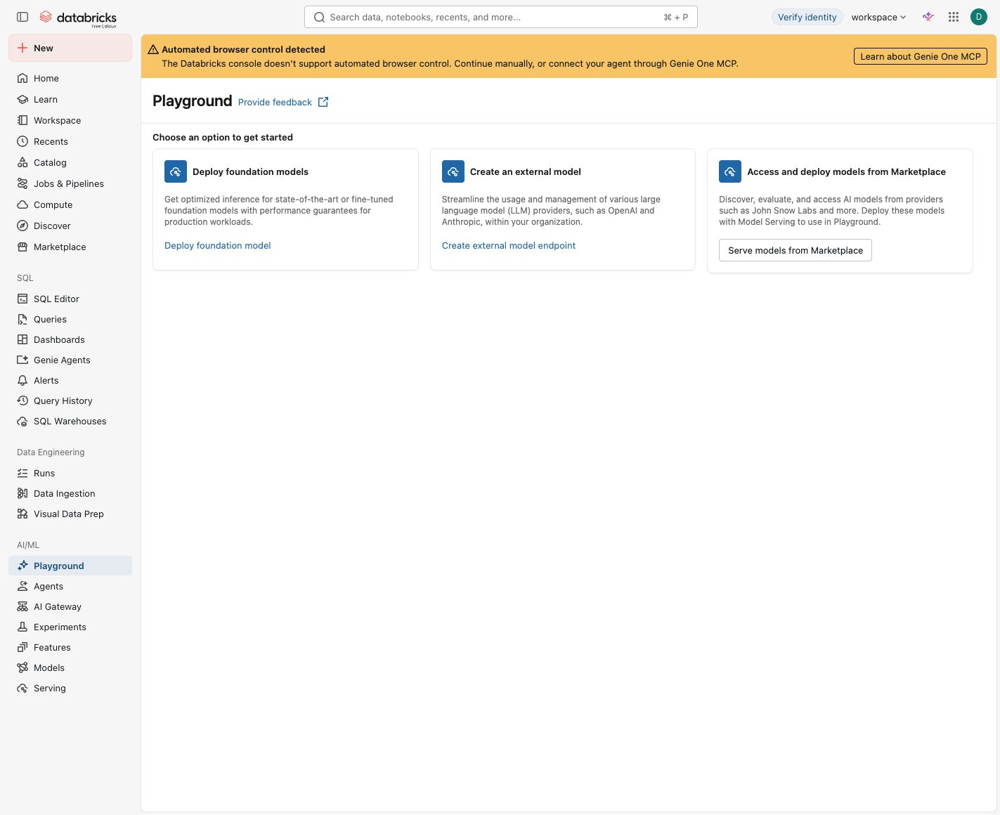

화면 30. Playground 사전 준비 화면 · [원본 보기](images/runbook/27-playground-prerequisites.jpg)

1. 왼쪽 **AI/ML > Playground**를 엽니다.
2. 강사가 지정한 모델 중 `Tools enabled` 모델을 선택합니다.
3. System prompt에 `resources/supervisor_prompt.md`의 전체 내용을 붙여 넣습니다.
4. `Tools > + Add tool`에서 Genie에 연결할 관리형 MCP 도구를 선택하고 `Cafe Sales Genie Agent`를 연결합니다. AI Search 도구에는 `cafe_training.cafe_hands_on.cafe_glossary_index`를 연결합니다. 도구 선택 화면과 제공 유형은 Workspace에서 확인합니다.
5. 아래 질문을 각각 새 대화에서 테스트합니다. 응답뿐 아니라 호출한 도구와 순서도 확인합니다.

| 입력 질문 | 확인할 동작 |
|---|---|
| `매장별 순매출을 비교해줘` | Genie로 매장별 매출 조회 |
| `아메 매출 알려줘` | AI Search로 용어 확인 후 Genie 조회 |
| `라떼 매출 알려줘` | AI Search 결과를 바탕으로 상품을 되묻기 |
| `손님 수가 가장 많은 매장은?` | 고객 데이터가 없음을 설명하고 대체 지표 제안 |

도구가 없거나 연결 오류가 나면 강사와 사용 권한·기능 활성화 상태를 확인합니다. 네 질문의 동작을 확인한 뒤 Export로 넘어갑니다. Apps 내보내기에는 Databricks Apps와 Managed MCP Servers preview가 필요합니다. 여기서 Supervisor는 두 도구를 선택·호출하는 Agent의 역할을 뜻합니다.

### 14-1. Playground에서 App으로 내보내기

AI Playground에서 Supervisor 구성 화면을 엽니다.

`Get code → Export to Databricks Apps`

입력값:

| 항목 | 값 |
|---|---|
| App name | agent-cafe-supervisor |
| App description | 카페 매출 Genie와 용어집 AI Search를 연결한 Supervisor Agent |
| MLflow experiment | cafe-supervisor-agent |

`Export` 후 생성된 App을 엽니다.

`Apps → agent-cafe-supervisor`

### 14-2. App Resource 연결

App 설정에서 다음 메뉴를 엽니다.

`Settings → Resources`

다음 리소스를 추가하거나 Export 결과를 확인합니다.

| Resource type | 대상 | Resource key | 권한 |
|---|---|---|---|
| Genie Agent | `Cafe Sales Genie Agent` | `cafe_genie` | Can run |
| AI Search index | `cafe_training.cafe_hands_on.cafe_glossary_index` | `cafe_glossary_index` | Can select |
| MLflow experiment | `cafe-supervisor-agent` | `cafe_experiment` | Can edit 이상 |

AI Search Index의 UI 리소스 유형은 Workspace 버전에 따라 `AI Search index` 또는 `Vector search index`로 표시될 수 있습니다.

앱 리소스는 App 서비스 주체에 최소 권한으로 부여합니다. AI Search Index는 `Can select`, Genie Agent는 `Can run` 권한을 사용합니다. ([Databricks Apps 리소스 문서](https://docs.databricks.com/aws/en/dev-tools/databricks-apps/resources))

### 14-3. 환경 변수 확인

`resources/app.yaml.example`의 리소스 키와 App Resources의 키가 일치해야 합니다.

```yaml
env:
  - name: GENIE_SPACE_ID
    valueFrom: cafe_genie
  - name: VECTOR_SEARCH_INDEX
    valueFrom: cafe_glossary_index
  - name: MLFLOW_EXPERIMENT_ID
    valueFrom: cafe_experiment
```

현재 Databricks UI의 `Genie Agent`가 내부 환경 변수에서 `GENIE_SPACE_ID`라는 이름을 사용하는 경우가 있으므로, 예제의 환경 변수 이름은 변경하지 않습니다.

### 14-4. App 실행과 확인

**완료 확인:** App 상태가 `Running`입니다.

다음 질문을 각각 실행합니다.

- 매장별 순매출을 비교해줘
- 아메 매출 알려줘
- 라떼 매출 알려줘
- 손님 수가 가장 많은 매장은?

예상 흐름:

| 항목 | 값 |
|---|---|
| 표준 질문 | Supervisor → Genie Agent |
| 별칭 질문 | Supervisor → AI Search → Genie Agent |
| 다의어 질문 | Supervisor → AI Search → 사용자 명확화 |
| 미지원 개념 | Supervisor → AI Search → 대체 지표 안내 |

App에서 각 질문의 응답과 도구 호출 순서를 확인합니다.

<a id="step-15"></a>

## 15. MLflow Trace·평가·모니터링

MLflow Trace는 Supervisor의 입력·출력·모델 호출·Genie 호출·AI Search 호출·실행 시간 등을 기록합니다. 개발 단계에서는 Trace를 조회하고 Scorer로 평가하며, 운영 단계에서는 같은 Scorer를 Production Monitoring에 재사용할 수 있습니다. ([MLflow 공식 문서](https://docs.databricks.com/aws/en/mlflow3/genai/eval-monitor))

### 15-1. Trace 생성

먼저 App에서 다음 평가 질문을 실행합니다.

- 매장별 순매출을 비교해줘
- 아메 매출 알려줘
- 라떼 매출 알려줘
- 손님 수가 가장 많은 매장은?

전체 평가 질문은 다음 파일에서 확인합니다.

`sample_data/support/agent_evaluation.csv`

### 15-2. MLflow 노트북 실행

Git folder에서 다음 노트북을 엽니다.

`notebooks/06_mlflow_monitoring.py`

Python Compute를 연결하고 첫 번째 셀을 실행합니다.

```python
%pip install -q --upgrade "mlflow[databricks]>=3.4.0"
dbutils.library.restartPython()
```

Python 재시작 후 노트북을 다시 열고 다음 셀부터 실행합니다.

### 15-3. MLflow Experiment 지정

위젯에 App에서 연결한 MLflow Experiment 경로를 입력합니다.

`experiment_path: /Shared/cafe-supervisor-agent`

App Export 화면에서 다른 경로를 사용했다면 해당 경로를 입력합니다. 노트북과 App이 같은 Experiment를 사용해야 App Trace가 조회됩니다.

예상 출력:

`MLflow experiment: /Shared/cafe-supervisor-agent`

### 15-4. Trace 조회

Trace 조회 셀을 실행합니다.

```python
traces = mlflow.search_traces(max_results=30)
display(traces)
```

Trace에서 다음 항목을 확인합니다.

- 입력 질문
- 최종 응답
- Supervisor 모델 호출
- Genie Agent Tool span
- AI Search Tool span
- Trace 상태
- 전체 latency
- 각 단계 latency

질문별 예상 Tool 경로:

| 항목 | 값 |
|---|---|
| 매장별 순매출 | genie |
| 아메 매출 | ai_search → genie |
| 라떼 매출 | ai_search |
| 손님 수 | ai_search |

### 15-5. 기본 Scorer 평가

평가 셀을 실행하면 다음 Scorer가 실행됩니다.

```python
from mlflow.genai.scorers import (
    RelevanceToQuery,
    Safety,
    ToolCallCorrectness,
)
```

평가 결과에서 다음 값을 확인합니다.

- RelevanceToQuery
- Safety
- ToolCallCorrectness

노트북은 `evaluation.metrics`와 `evaluation.result_df`를 출력합니다.

```python
print(evaluation.metrics)
display(evaluation.result_df)
```

`ToolCallCorrectness`는 Trace의 Tool span을 사용해 도구 선택과 인자를 평가합니다. ([MLflow ToolCallCorrectness 문서](https://mlflow.org/docs/latest/genai/eval-monitor/scorers/llm-judge/tool-call/correctness/))

### 15-6. MLflow UI 확인

Workspace 왼쪽 메뉴에서 다음을 선택합니다.

`AI/ML → Experiments`

`/Shared/cafe-supervisor-agent` Experiment를 열고 다음 탭을 확인합니다.

- Traces
- Evaluations
- Runs

Trace 하나를 열어 입력, 출력, Tool span, latency를 확인합니다. Evaluation 결과에서는 Scorer별 결과와 실패한 질문을 확인합니다.

### 15-7. 운영 모니터링 선택 실습

Production Monitoring Preview가 Workspace에서 활성화된 경우에만 다음 셀을 실행합니다.

```python
from mlflow.genai.scorers import Safety, ScorerSamplingConfig

safety_monitor = Safety().register(name="cafe_safety")
safety_monitor = safety_monitor.start(
    sampling_config=ScorerSamplingConfig(sample_rate=0.5)
)
print(safety_monitor)
```

**샘플링 비율:** `sample_rate: 0.5`

### 15-8. 완료 기준

- App 질문 4개 이상 실행
- MLflow Experiment에 Trace 생성
- Genie·AI Search Tool span 확인
- latency 확인
- RelevanceToQuery·Safety·ToolCallCorrectness 실행
- Evaluation 결과 확인
- MLflow UI에서 Trace와 Evaluation 확인
- Production Monitoring은 Preview일 때만 선택 실행

<a id="step-16"></a>

## 16. 최종 통합 검증

각 기능을 따로 확인한 뒤 하나의 사용자 질문이 `Supervisor → AI Search/Genie → App → MLflow` 흐름을 통과하는지 검증합니다.

### 16-1. 데이터와 의미 계층 확인

| 항목 | 기대값 |
|---|---:|
| bronze_orders | 300 |
| silver_orders_clean | 296 |
| gold_sales | 266 |
| net_sales | 1,734,580 |
| order_count | 266 |
| avg_order_value | 약 6,520.98 |

확인 대상:

- `cafe_training.cafe_hands_on.gold_sales`
- `cafe_training.cafe_hands_on.cafe_sales_metrics`

### 16-2. Genie 상태 확인

| 항목 | 값 |
|---|---|
| Genie Agent | Cafe Sales Genie Agent |
| 연결 자산 | cafe_training.cafe_hands_on.cafe_sales_metrics 하나 |
| Example Query | 6개 |
| Chat Benchmark | 8개 |
| Agent Benchmark | 4개 |
| Evaluations | 최소 1회 |
| Monitor | 질문·응답·생성 SQL 확인 |

### 16-3. AI Search 상태 확인

| 항목 | 값 |
|---|---|
| Source table | cafe_training.cafe_hands_on.cafe_glossary |
| 행 수 | 19 |
| Endpoint | cafe-ai-search-endpoint / ONLINE |
| Index | cafe_training.cafe_hands_on.cafe_glossary_index / ONLINE |
| Sync | TRIGGERED 완료 |
| Query type | HYBRID |

### 16-4. App 통합 질문 실행

App에서 다음 4개 질문을 새 대화로 각각 실행합니다.

- Q1. 매장별 순매출을 비교해줘
- Q2. 아메 매출 알려줘
- Q3. 라떼 매출 알려줘
- Q4. 손님 수가 가장 많은 매장은?

질문별 기대 결과:

| 질문 | 기대 Tool 경로 | 기대 결과 |
|---|---|---|
| Q1 | Genie | 매장별 순매출 표 |
| Q2 | AI Search → Genie | `아메`를 `아메리카노`로 해석한 매출 결과 |
| Q3 | AI Search | 카페라떼·바닐라라떼 중 선택 질문 |
| Q4 | AI Search | 고객 데이터 부재와 주문수·판매수량 대안 안내 |

예상 결과가 다르면 App의 응답, 도구 호출, AI Search 검색 결과, Genie 생성 SQL 순서로 확인합니다.

### 16-5. MLflow 통합 확인

MLflow Experiment에서 Q1~Q4 Trace를 확인합니다.

| 항목 | 값 |
|---|---|
| Q1 | Genie Tool span |
| Q2 | AI Search Tool span → Genie Tool span |
| Q3 | AI Search Tool span |
| Q4 | AI Search Tool span |

각 Trace에서 다음 값을 기록합니다.

```text
trace_id:
question:
tool_sequence:
status:
latency:
RelevanceToQuery:
Safety:
ToolCallCorrectness:
```

### 16-6. 최종 결과 기록

```text
Genie Chat Accuracy:
Genie Agent Accuracy:
Supervisor routing 결과:
MLflow Trace 개수:
RelevanceToQuery 결과:
Safety 결과:
ToolCallCorrectness 결과:
가장 먼저 개선할 항목:
```

### 16-7. 실습 완료 기준

- 데이터 행 수와 Metric View 지표 확인
- Genie Example Query·Benchmark·Monitor 확인
- AI Search Endpoint·Index ONLINE 확인
- App에서 Q1~Q4 실행
- Q1~Q4의 기대 Tool 경로 확인
- MLflow에서 Q1~Q4 Trace 확인
- 세 가지 Scorer 결과 확인
- 개선할 항목 한 가지 기록

---

**강사용 배포 · 마무리**

<a id="step-17"></a>

## 17. GitHub 반영 및 참가자 배포

이 절은 **강사·저장소 관리자용 배포 절차**입니다. 참가자는 GitHub에 push할 필요가 없습니다.

최종 검증이 끝난 문서와 이미지 파일을 함께 GitHub에 반영합니다. 터미널 또는 PowerShell에서 로컬 저장소 `dbx-cafe-hands-on` 폴더로 이동한 뒤 아래 명령을 실행합니다. 현재 브랜치와 변경 파일을 먼저 확인하고 저장소의 리뷰·병합 절차를 따릅니다.

최종 반영 명령:

```powershell
git status
git branch --show-current
git diff --check
git add HANDS_ON_SESSION_DESIGN.md README.md docs notebooks/06_mlflow_monitoring.py resources/app_resource_binding.example.yml
git commit -m "Finalize hands-on integration guide"
git pull --rebase origin main
git push origin main
git status
```

GitHub 반영 후 Databricks Git folder에서 다음을 선택합니다.

- Git folder 메뉴 > Pull 또는 Update
- Branch: main

참가자는 각자 만든 Databricks Free Edition 계정의 Workspace에서 같은 public repository를 Clone합니다. 각자의 환경에서 `cafe_training`, `cafe_hands_on` 등 문서의 고정 이름을 그대로 사용합니다. 자세한 준비 절차는 [시작하기](00_start_here.md)를 참고합니다.

<a id="step-18"></a>

## 18. 최종 확인표

### 기초 실습 · 2~12절

- [ ] Git folder가 `main` 브랜치로 연결됨
- [ ] Catalog·Schema·Volume 생성 완료
- [ ] 원천 CSV와 `glossary.csv` 업로드 완료
- [ ] `cafe_medallion_pipeline` 성공
- [ ] `cafe_medallion_job`의 두 Task 성공
- [ ] `bronze_orders=300`, `silver_orders_clean=296`, `gold_sales=266`
- [ ] Metric View 기준선 및 최적화 정의 성공
- [ ] `Cafe Sales Genie Agent` 생성 완료
- [ ] Metric View 하나만 연결됨
- [ ] Example Query 6개 등록 완료
- [ ] Chat Benchmark 8개 등록 및 실행 완료
- [ ] Agent Benchmark 4개 등록 및 실행 완료
- [ ] Evaluations에서 Accuracy 확인
- [ ] Monitor에서 질문·응답·생성 SQL 확인

### 심화 실습 · 13~16절

- [ ] `cafe_glossary` 테이블과 AI Search Index 생성 완료
- [ ] AI Search Endpoint와 Index가 `ONLINE`
- [ ] Triggered Sync와 Hybrid 검색 결과 확인
- [ ] `agent-cafe-supervisor` App 실행
- [ ] Genie·AI Search·MLflow Resource 연결
- [ ] MLflow Trace 생성 및 Tool span 확인
- [ ] RelevanceToQuery·Safety·ToolCallCorrectness 평가 완료
- [ ] 순매출 질문 정상 응답
- [ ] 다의어 질문에서 되묻는 응답 확인
