# 1부 · 환경 준비

> 이 부에서 진행하는 절: **2~4절**

[← 시작하기](README.md) · [목차](README.md) · [2부 데이터 파이프라인 →](2_pipeline.md)

<a id="step-2"></a>

## 2. GitHub 저장소를 Git folder로 받기

### 2-1. Git folder 생성

**이동:** `Workspace → Home(개인 폴더) → Create → Git folder`

<a href="../images/runbook/01-create-menu-annotated.png">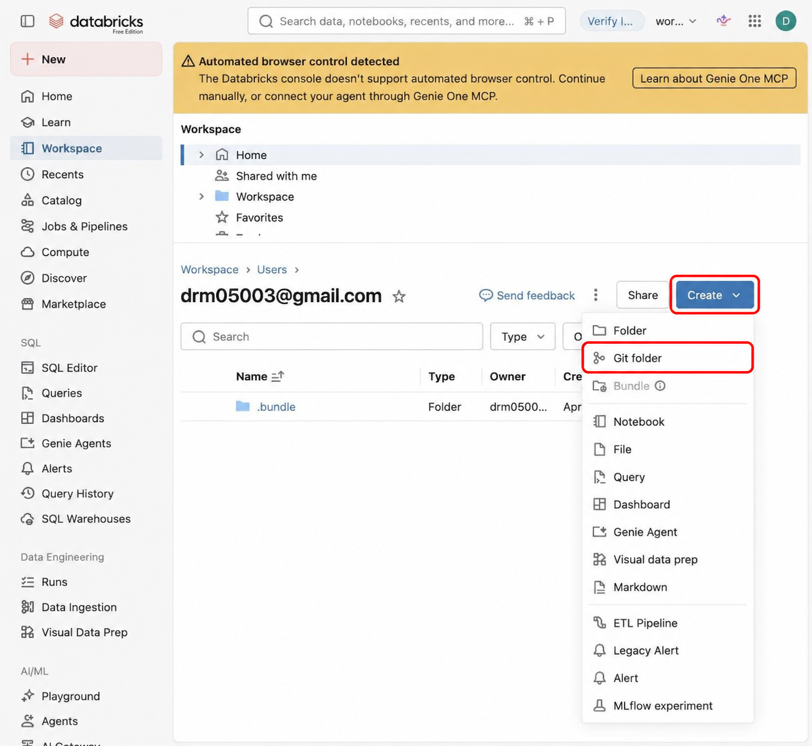

</a>

<sub>*화면 2 · Git folder 생성 메뉴*</sub>

입력값:


| 항목                 | 값                                                    |
| ------------------ | ---------------------------------------------------- |
| Git repository URL | `https://github.com/yisakh843/dbx-cafe-hands-on.git` |
| Provider           | GitHub                                               |
| Git folder name    | `dbx-cafe-hands-on`                                  |


위 값을 입력한 뒤 **Create Git folder**를 누릅니다.

<a href="../images/runbook/02-create-git-folder-annotated.png">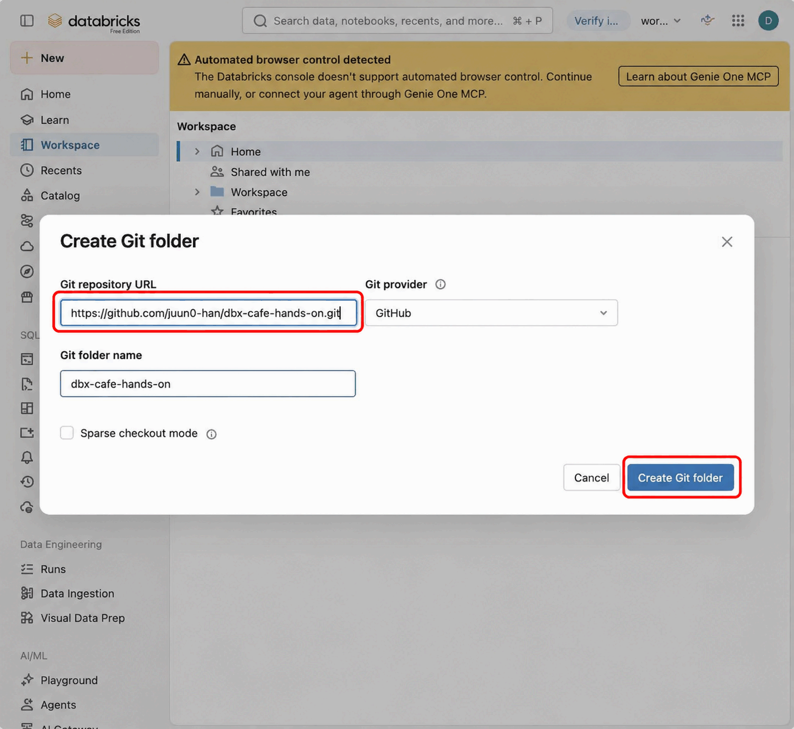

</a>

<sub>*화면 3 · 저장소 연결 정보*</sub>

폴더는 다음 위치에 만들어집니다.

```text
/Workspace/Users/<사용자 이메일>/dbx-cafe-hands-on
```

**완료 확인:** 폴더 이름 옆 브랜치가 **main**이고, 다음 항목이 보이면 됩니다. Databricks에서는 노트북의 `.sql`·`.py` 확장자가 보이지 않을 수 있습니다.

- `README.md`
- `databricks.yml`
- `docs/`
- `notebooks/`
- `resources/`
- `sample_data/`

<a href="../images/runbook/03-git-folder-ready.jpg">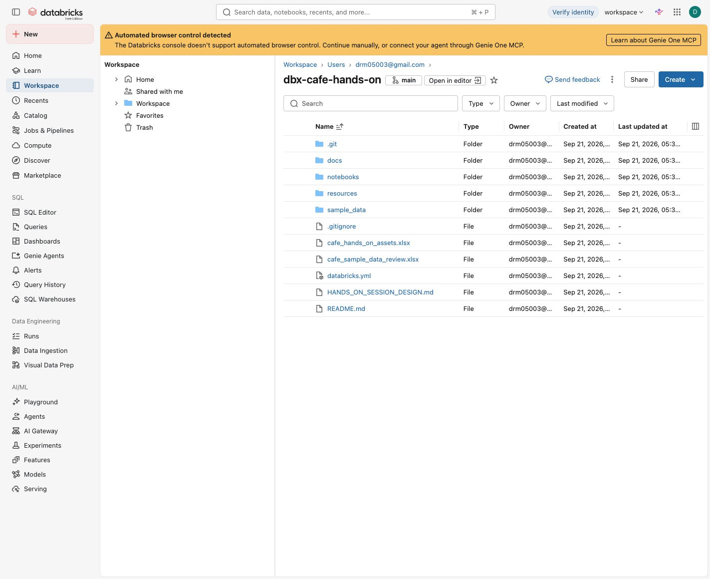

</a>

<sub>*화면 4 · Clone 완료와 main 브랜치*</sub>

### 2-2. (참고) 문서

실습에 필요한 이름, 경로, 입력값, 검증값은 모두 이 가이드(`docs/runbook/`)에 있으니 실습하는 동안 계속 열어 둡니다. 배경이 궁금하면 다음 문서를 참고하시면 됩니다.

- `README.md` — 저장소 구조와 실행 순서
- `docs/00_start_here.md` — Catalog·Schema·Volume 준비
- `HANDS_ON_SESSION_DESIGN.md` — 세션 설계

### 2-3. 로컬 PC로 파일 내려받기

Volume에 올릴 파일은 내 PC에서 선택해야 하므로, 다음 방법 중 하나로 저장소 파일을 PC에 받아 둡니다.

방법 A: GitHub 저장소 화면에서 `Code > Download ZIP`을 선택한 뒤 압축을 해제합니다.


---

<a id="step-3"></a>

## 3. Catalog, Schema, Volume 준비

### 3-1. SQL Warehouse 연결

Git folder에서 다음 파일을 열고 SQL Warehouse를 연결합니다.

`notebooks/00_setup.sql`

1. 노트북 상단 Compute 버튼이 `Serverless`이면 **Serverless → More… → SQL Warehouse**를 선택합니다.
2. 교육용 Warehouse를 고릅니다. Free Edition의 기본 Warehouse 이름은 `Serverless Starter Warehouse`입니다.
3. **SQL Warehouse**가 선택되어 있고 Warehouse 이름이 맞는지 확인한 뒤 **Start and attach**(이미 실행 중이면 **Attach**)를 누릅니다.

아래는 **Serverless → More…** 메뉴에서 **SQL Warehouse**를 선택하면 나타나는 연결 창입니다.

<a href="../images/runbook/04-attach-warehouse-annotated.png">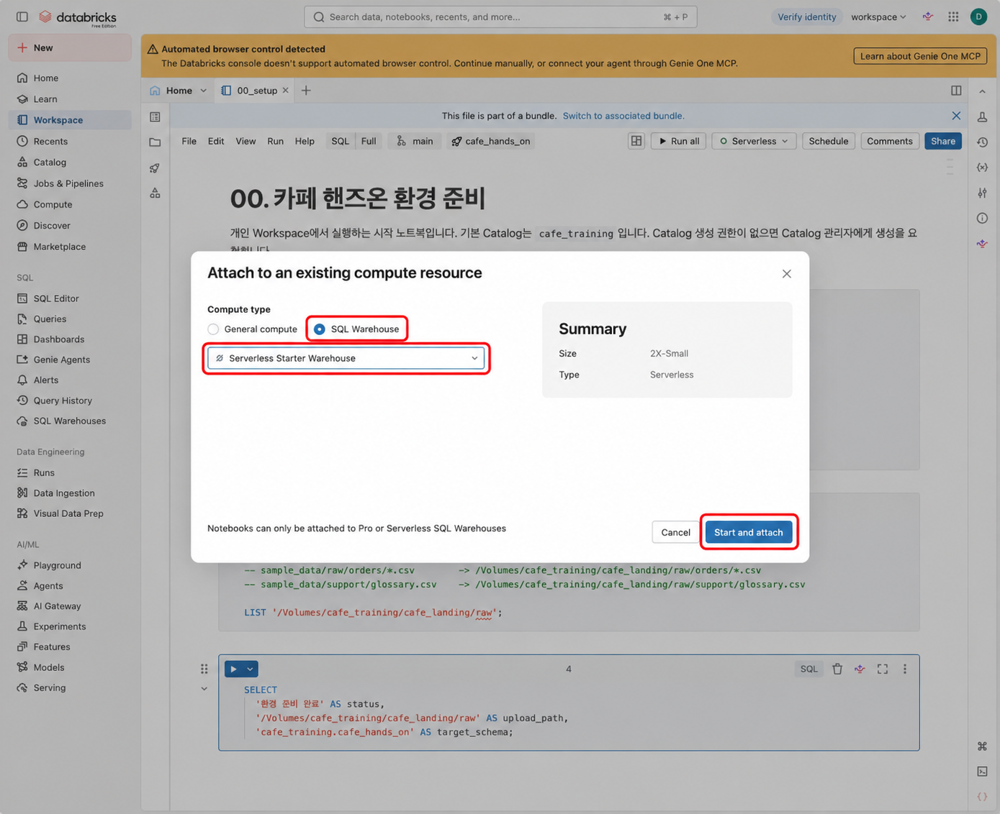

</a>

<sub>*화면 5 · SQL Warehouse 연결*</sub>

### 3-2. Setup 실행

상단에 Warehouse 이름이 보이면 **Run all**을 눌러 전체를 실행합니다. 셀 왼쪽의 실행 버튼은 그 셀 하나만 실행하므로 혼동하지 않도록 주의합니다.

<a href="../images/runbook/05-setup-run-all-annotated.png">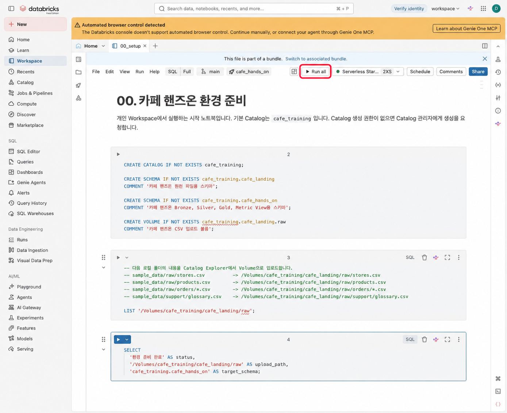

</a>

<sub>*화면 6 · Setup 노트북 전체 실행*</sub>

### 3-3. 생성 객체 확인

Setup 노트북은 Schema 두 개(`cafe_landing`, `cafe_hands_on`)와 Volume `cafe_training.cafe_landing.raw`를 만듭니다. Catalog Explorer에서 다음 구조를 확인합니다.

```text
cafe_training
├── cafe_landing
│   └── Volumes
│       └── raw
└── cafe_hands_on
```

왼쪽에서 **cafe\_training → cafe\_landing → Volumes → raw**를 엽니다. 아직 파일을 올리기 전이라 목록은 비어 있습니다.

<a href="../images/runbook/06-volume.jpg">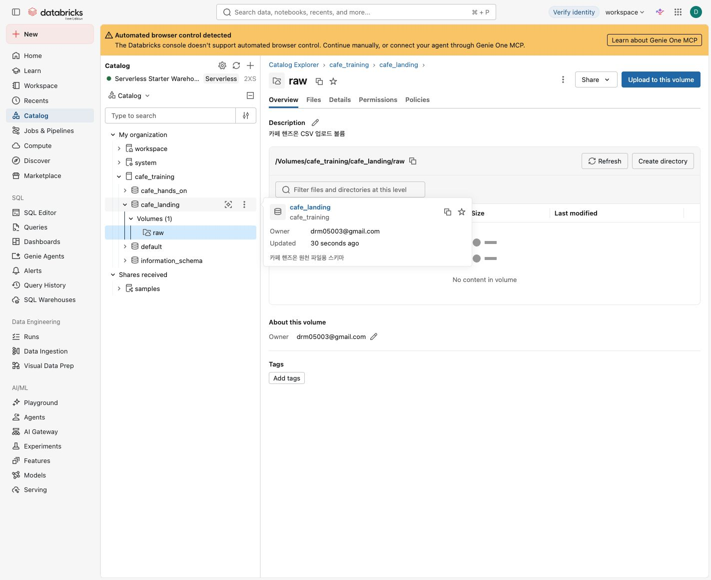

</a>

<sub>*화면 7 · raw Volume 위치*</sub>

---

<a id="step-4"></a>

## 4. CSV를 Volume에 업로드

**이동:** `Catalog → cafe_training → cafe_landing → Volumes → raw`

### 4-1. 업로드할 디렉터리 만들기

`raw` Volume의 **Create directory**로 `orders`를 만듭니다. 파일 목록 위 경로에서 `raw`로 돌아온 뒤, 같은 방법으로 `support`를 만듭니다.

<a href="../images/runbook/08-create-directory.jpg">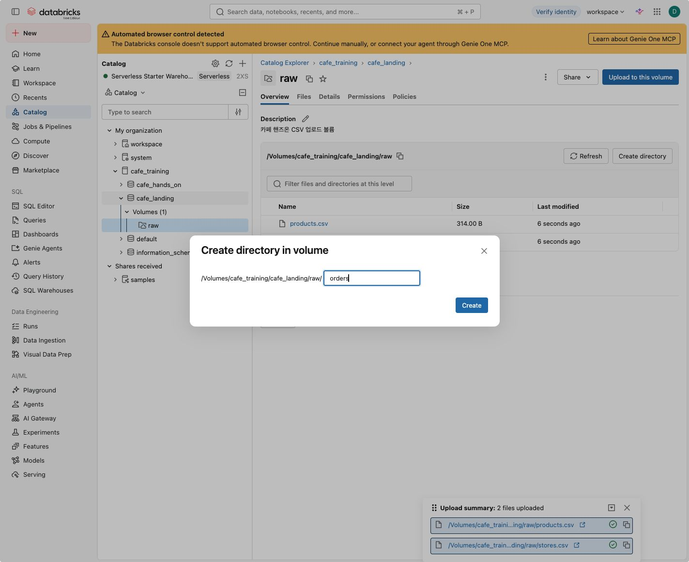

</a>

<sub>*화면 8 · 디렉터리 생성*</sub>

**완료 확인:** `orders`와 `support`가 모두 `raw` 바로 아래에 있습니다.

### 4-2. 매장·상품 파일 업로드

`raw`에서 **Upload to this volume → browse → Select files**를 선택합니다. 아래 두 파일을 고르고 **Destination volume**을 확인한 뒤 **Upload**를 누릅니다.


| 항목     | 값                            |
| ------ | ---------------------------- |
| 로컬 폴더  | `sample_data/raw/`           |
| 선택할 파일 | `stores.csv`, `products.csv` |


**업로드 목적지:**

```text
/Volumes/cafe_training/cafe_landing/raw
```

<a href="../images/runbook/07-upload-root-annotated.png">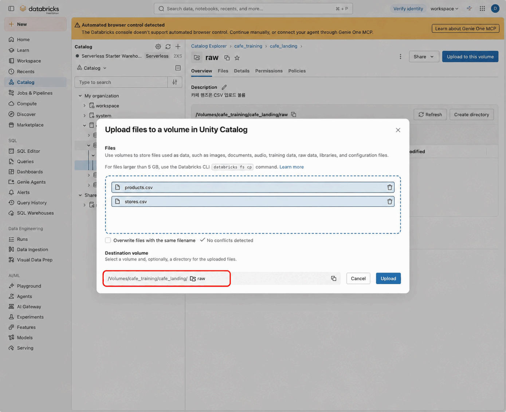

</a>

<sub>*화면 9 · 매장·상품 업로드*</sub>

**완료 확인:** `raw`에 `stores.csv`, `products.csv`가 보입니다.

### 4-3. 주문 배치 세 개 업로드

`orders` 디렉터리를 열고 같은 방법으로 아래 세 파일을 업로드합니다. 목적지 끝이 **orders**인지 확인합니다.


| 항목     | 값                                                                      |
| ------ | ---------------------------------------------------------------------- |
| 로컬 폴더  | `sample_data/raw/orders/`                                              |
| 선택할 파일 | `orders_batch_001.csv`, `orders_batch_002.csv`, `orders_batch_003.csv` |


**업로드 목적지:**

```text
/Volumes/cafe_training/cafe_landing/raw/orders
```

<a href="../images/runbook/09-upload-orders-annotated.png">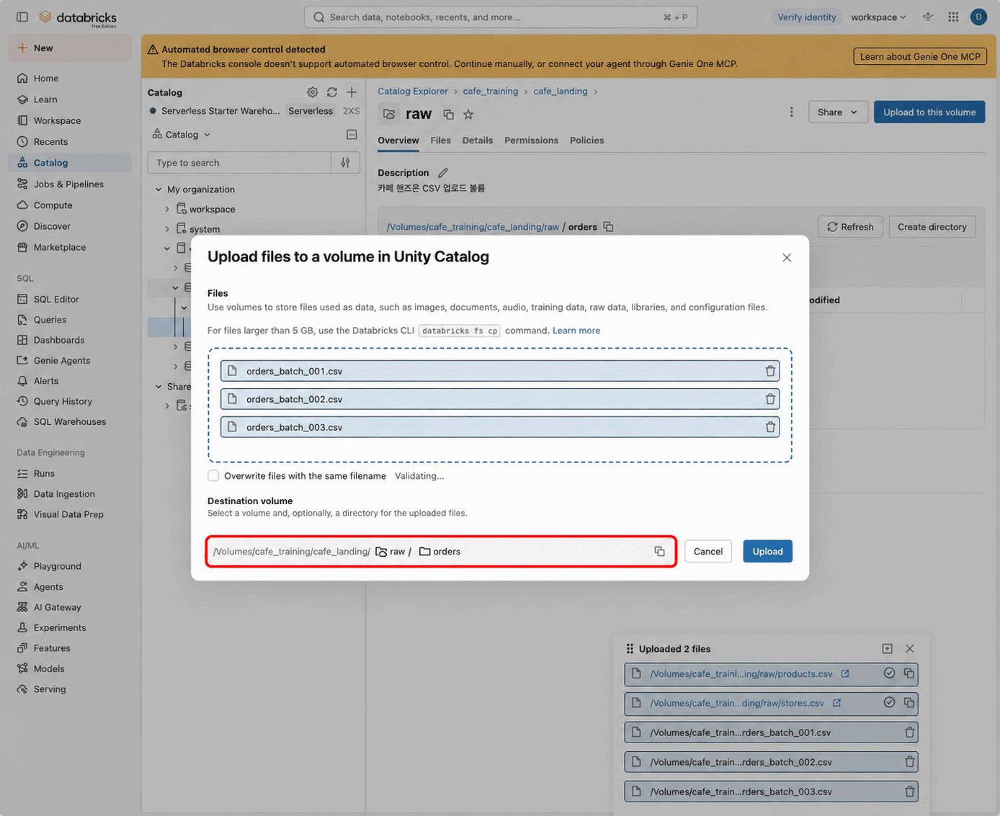

</a>

<sub>*화면 10 · 주문 배치 업로드*</sub>

**완료 확인:** `orders` 안에 주문 배치 CSV 세 개가 보입니다.

### 4-4. 용어집 업로드

`raw`로 돌아온 뒤 `support` 디렉터리를 엽니다. `sample_data/support/glossary.csv`를 선택하고 목적지 끝이 **support**인지 확인한 뒤 업로드합니다.

**업로드 목적지:**

```text
/Volumes/cafe_training/cafe_landing/raw/support
```

<a href="../images/runbook/10-upload-glossary-annotated.png">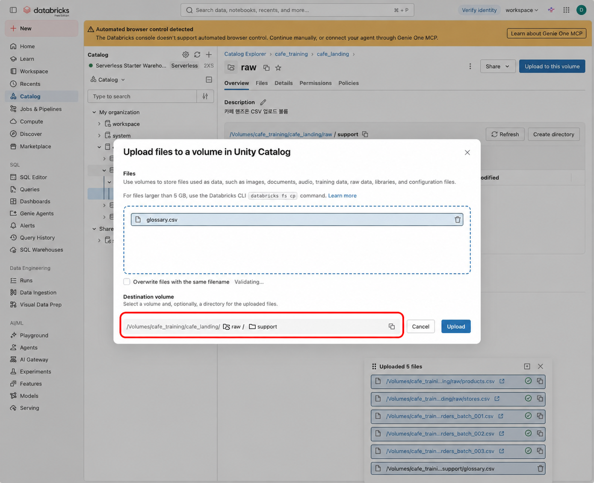

</a>

<sub>*화면 11 · 용어집 업로드*</sub>

**완료 확인:** `support` 안에 `glossary.csv`가 보입니다.

### 4-5. 최종 파일 구조 확인

`raw`로 돌아가 아래 구조와 비교합니다. 업로드 요약이 표시되어 있다면 **6 files uploaded**도 확인합니다.

<a href="../images/runbook/11-volume-ready.jpg">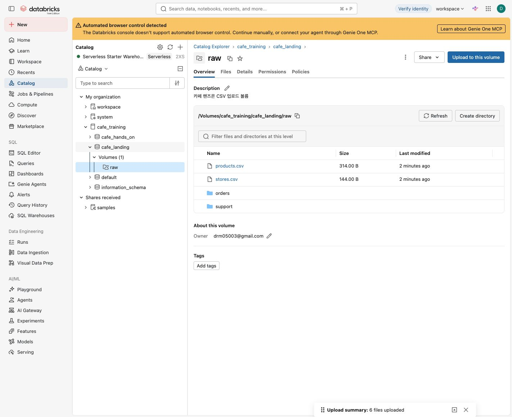

</a>

<sub>*화면 12 · Volume 업로드 완료*</sub>

```text
raw/
├── stores.csv
├── products.csv
├── orders/
│   ├── orders_batch_001.csv
│   ├── orders_batch_002.csv
│   └── orders_batch_003.csv
└── support/
    └── glossary.csv
```

**완료 확인:** 루트에 CSV 두 개, `orders`에 세 개, `support`에 한 개, 모두 6개가 있으면 됩니다.

---

[← 시작하기](README.md) · [목차](README.md) · [2부 데이터 파이프라인 →](2_pipeline.md)
