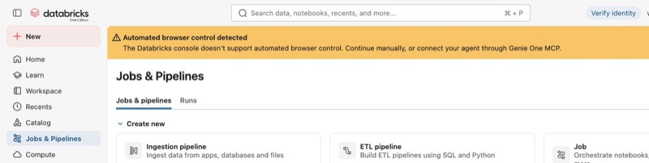
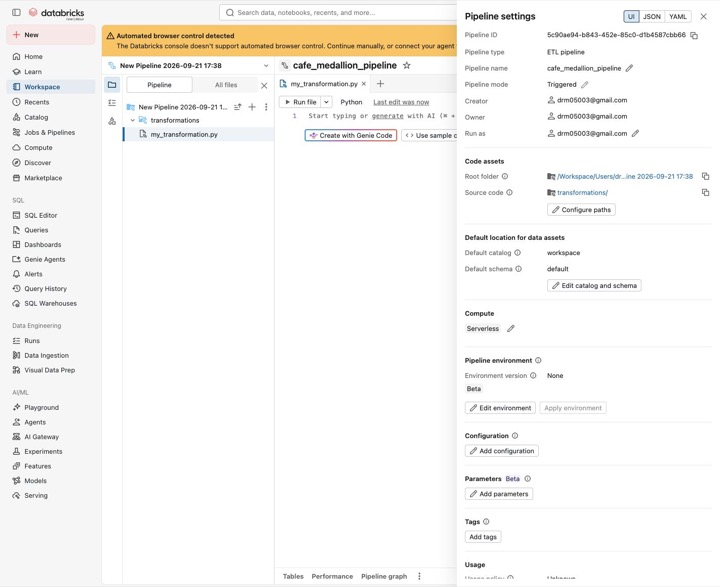
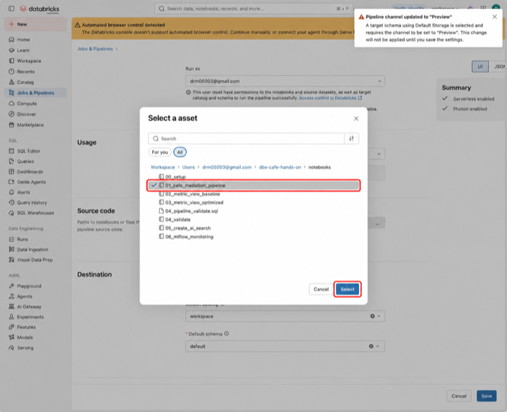
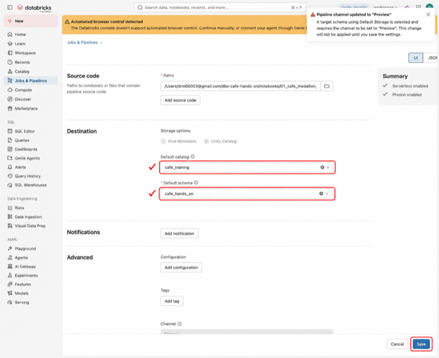
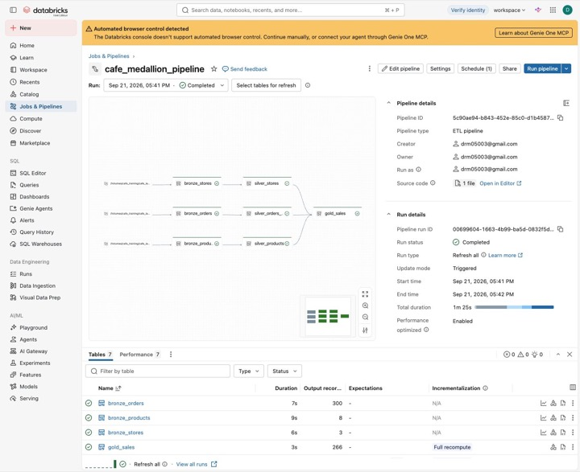
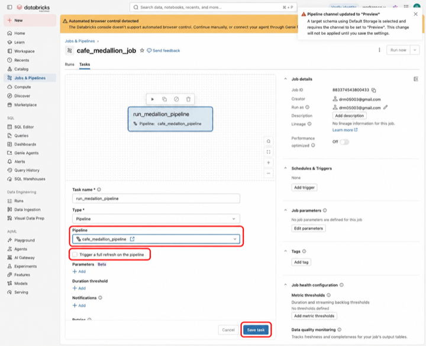
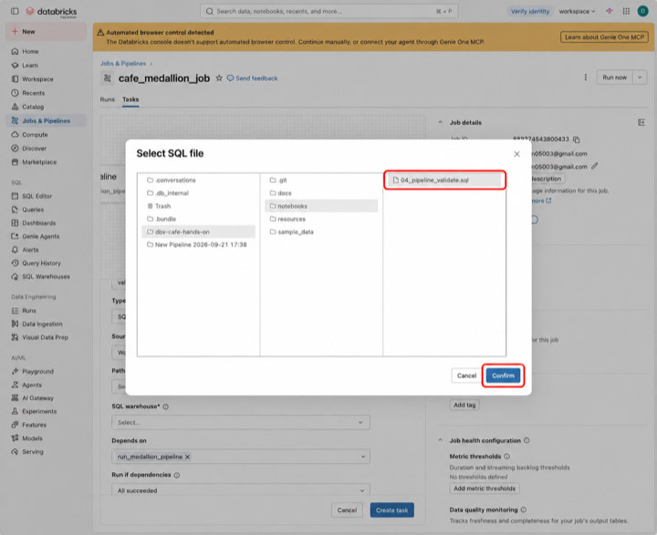
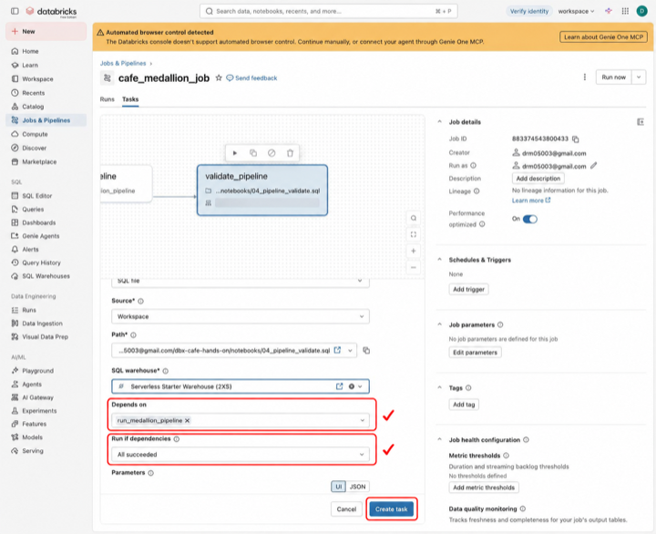
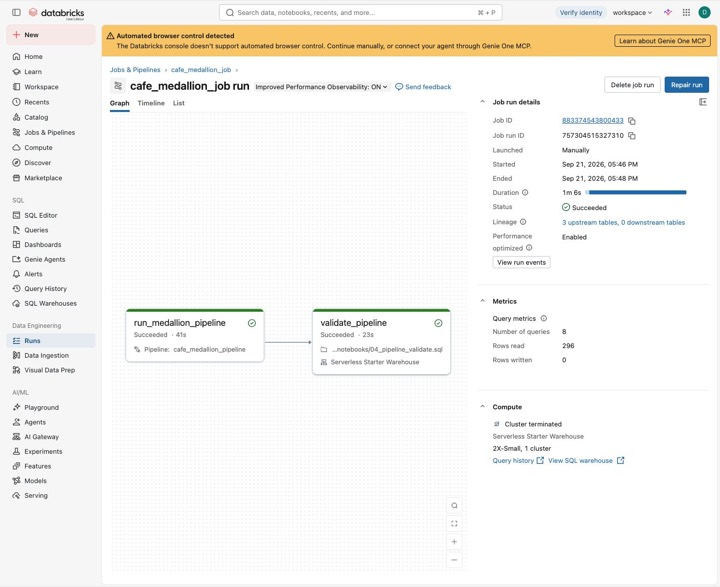
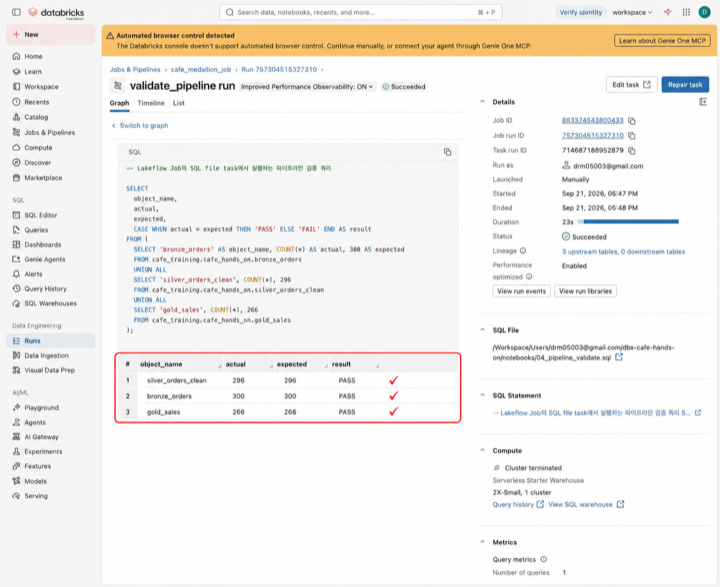

# 2부 · 데이터 파이프라인

> 이 부에서 진행하는 절: **5~6절**

[← 1부 환경 준비](1_setup.md) · [목차](README.md) · [3부 Metric View와 Genie →](3_metric_genie.md)

## 5. Lakeflow Pipeline 생성

### 5-1. 무엇을 만드나

앞에서 Volume에 올린 CSV를 읽고 정제해, **Bronze·Silver·Gold 데이터셋 7개**를 만듭니다.

생성하는 Pipeline은 **하나**입니다. 각 데이터셋을 만드는 SQL은 `notebooks/01_cafe_medallion_pipeline.sql`에 이미 작성되어 있으므로, 이 파일을 Pipeline에 연결하면 됩니다.

| 계층 | 생성할 데이터셋 | 하는 일 |
|---|---|---|
| Bronze | `bronze_stores`, `bronze_products`, `bronze_orders` | CSV를 Streaming Table로 적재하고 원본 파일 경로와 적재 시각을 기록합니다. |
| Silver | `silver_stores`, `silver_products`, `silver_orders_clean` | 타입과 필수값을 정리합니다. 주문은 중복 제거, NULL 할인율 보정, 상태값 표준화를 거치고, 품질 규칙(Expectation)을 위반한 행은 제외합니다. |
| Gold | `gold_sales` | 완료 주문에 매장·상품 정보를 결합하고 순매출·요일·시간대 등 분석용 값을 계산합니다. |

Silver와 Gold는 Materialized View입니다. Lakeflow는 SQL에서 참조하는 데이터셋을 보고 다음 의존 관계(DAG)와 실행 순서를 자동으로 구성합니다.

```text
CSV → bronze_stores   → silver_stores       ─┐
CSV → bronze_orders   → silver_orders_clean ─┼→ gold_sales
CSV → bronze_products → silver_products     ─┘
```

> **실행 위치:** `01_cafe_medallion_pipeline.sql`은 Pipeline에 연결할 소스입니다. 3절 setup 노트북처럼 SQL Warehouse에서 `Run all`하지 않습니다.

### 5-2. Pipeline 만들기

**이동:** `Jobs & Pipelines → ETL pipeline`

여기서는 **ETL pipeline**을 선택합니다. 옆의 **Job**은 6절에서 사용합니다.

[](../images/runbook/12-jobs-entry.jpg)

*화면 13 · ETL pipeline 진입 메뉴*

`ETL pipeline`을 누르면 기본 Pipeline과 빈 소스 파일이 자동으로 만들어집니다.

1. 상단 Pipeline 이름을 `cafe_medallion_pipeline`으로 바꾸고 **Enter**를 누릅니다.
2. **Settings**를 엽니다.

열린 **Settings 패널(화면 14)**에서 다음 값을 확인합니다.

- **Pipeline name:** `cafe_medallion_pipeline`
- **Pipeline mode:** `Triggered` — 한 번 실행해 처리를 마치는 모드
- **Compute:** `Serverless`

> **자동 생성된 파일:** 화면 14의 `transformations/my_transformation.py`는 빈 파일입니다. 다음 단계에서 제공된 SQL 파일을 연결하므로, 여기에 코드를 붙여 넣을 필요는 없습니다.

[](../images/runbook/13-pipeline-settings-entry.jpg)

*화면 14 · Pipeline 설정*

### 5-3. SQL 소스 연결과 출력 위치 설정

**Settings 패널을 아래로 내려 Legacy pipeline settings를 엽니다.** 이 교재의 화면 15~16은 해당 설정 화면을 기준으로 합니다.

Legacy 설정에서는 다음 두 항목을 지정합니다.

- **Source code:** Pipeline이 실행할 SQL 파일
- **Destination:** 결과 데이터셋을 저장할 Catalog와 Schema

#### ① 실행할 SQL 파일 선택

1. **Source code**에서 자동 등록된 `transformations/**` 경로를 제거합니다.
2. 아래 폴더에서 **01_cafe_medallion_pipeline** 하나만 선택합니다. 저장소의 파일명은 `01_cafe_medallion_pipeline.sql`입니다.

```text
/Workspace/Users/<사용자 이메일>/dbx-cafe-hands-on/notebooks
```

> **파일 하나만 선택:** `notebooks` 폴더 전체를 지정하면 setup·Metric View·검증 파일까지 함께 실행됩니다. 소스 목록에서 경로만 제거하면 되며, Workspace의 빈 파일 자체를 삭제할 필요는 없습니다.

[](../images/runbook/14-pipeline-source-annotated.png)

*화면 15 · Pipeline 소스 선택*

#### ② 결과를 저장할 위치 지정

**Destination**에 다음 값을 입력합니다.

| 입력 항목 | 값 |
|---|---|
| Default catalog | `cafe_training` |
| Default schema | `cafe_hands_on` |

입력 CSV는 `cafe_landing`, 결과 데이터셋은 **`cafe_hands_on`**에 저장합니다.

#### ③ 소스와 출력 위치 확인 후 저장

저장 전에 아래 세 값을 확인합니다.

- **Source code → Paths:** 선택한 `01_cafe_medallion_pipeline` 파일 하나
- **Destination → Default catalog:** `cafe_training`
- **Destination → Default schema:** `cafe_hands_on`

확인했으면 **Save**를 누릅니다.

[](../images/runbook/15-pipeline-settings-annotated.png)

*화면 16 · 소스 경로와 출력 위치*

### 5-4. 실행과 결과 확인

#### ① 실행 상태와 DAG 확인

**Run pipeline**을 클릭하고 실행이 끝날 때까지 기다립니다.

- 실행 상태가 **Completed**입니다.
- DAG의 **7개 데이터셋이 모두 성공**으로 표시됩니다.
- 세 Silver 데이터셋이 **`gold_sales`로 연결**됩니다.

[](../images/runbook/19-pipeline-completed.jpg)

*화면 17 · Pipeline 실행 결과*

#### ② 행 수와 정제 결과 확인

제공된 샘플 CSV를 모두 적재하면, 주문 데이터는 다음 순서로 정리됩니다.

| 단계 | 기대 행 수 | 처리 내용 |
|---|---:|---|
| `bronze_orders` | 300 | 주문 CSV 3개의 원본을 적재합니다. |
| 중복 제거 후 SQL 중간 결과 | 298 | `order_id`가 중복된 2행을 제거합니다. 별도 테이블로 생성되지는 않습니다. |
| `silver_orders_clean` | 296 | 수량이 0 이하인 2행을 Expectation으로 제외합니다. |
| `gold_sales` | 266 | 취소 주문 30행을 제외하고 매장·상품 정보를 결합합니다. |

화면 17의 아래 **Tables → Output records**에는 `bronze_orders` 300행과 `gold_sales` 266행이 보입니다.

Silver 296행을 포함한 세 데이터셋의 저장된 전체 행 수는 [6절의 검증 SQL 결과](#6-lakeflow-job-생성)와 화면 22에서 확인합니다.

#### ③ Expectation의 역할 이해

`silver_orders_clean`에는 다음 품질 규칙이 선언되어 있습니다.

```sql
CONSTRAINT positive_quantity EXPECT (quantity > 0) ON VIOLATION DROP ROW
```

`quantity > 0`을 만족하지 않는 행은 Silver 결과에서 제외합니다. 샘플의 **수량 오류 2행**이 여기에 해당합니다.

각 처리의 역할을 구분해 봅니다.

- **중복 2행:** SQL의 `ROW_NUMBER()`로 제거합니다.
- **수량 오류 2행:** `positive_quantity` Expectation으로 제외합니다.
- **취소 주문 30행:** Silver에는 유지하고, Gold에서 제외합니다.

Catalog Explorer의 `cafe_training.cafe_hands_on`에서도 생성된 데이터셋을 볼 수 있습니다.

> **다음 단계:** Pipeline을 직접 실행해 데이터 흐름과 정제 결과를 확인했습니다. 6절에서는 **Pipeline 실행 → 행 수 검증**을 하나의 Job으로 묶습니다.

---

## 6. Lakeflow Job 생성

**이동:** `Jobs & Pipelines → Job`

1. 상단 Job 이름을 `cafe_medallion_job`으로 바꾸고 **Enter**를 누릅니다.
2. **Add another task type → ETL Pipeline**으로 첫 Task를 추가합니다.

### 6-1. Pipeline 실행 Task

| 항목           | 값                         |
| ------------ | ------------------------- |
| Task name    | `run_medallion_pipeline`  |
| Task type    | Pipeline                  |
| Pipeline     | `cafe_medallion_pipeline` |
| Full refresh | Off                       |

**Task name**, **Pipeline**을 확인하고 **Trigger a full refresh**는 체크하지 않습니다. **Save task**를 누릅니다.

[](../images/runbook/16-job-pipeline-task-annotated.png)

*화면 18 · Pipeline 실행 Task*

### 6-2. Pipeline 검증 Task

#### ① 검증 Task 추가

**Add task → SQL file**을 선택하고 다음 값을 입력합니다.

> 저장한 뒤 다시 열면 **Type = SQL / SQL task = File**로 표시됩니다. 같은 설정입니다.

| 항목            | 값                        |
| ------------- | ------------------------ |
| Task name     | `validate_pipeline`      |
| Task type     | SQL file                 |
| SQL Warehouse | 앞 단계에서 사용한 SQL Warehouse |

#### ② 검증 SQL 파일 연결

**SQL 파일:** `notebooks/04_pipeline_validate.sql`

파일 선택창에서 **Users → 본인 계정 → dbx-cafe-hands-on → notebooks → 04\_pipeline\_validate.sql**을 선택하고 **Confirm**을 누릅니다.

[](../images/runbook/17-job-sql-file-annotated.png)

*화면 19 · 검증 SQL 파일 선택*

#### ③ 실행 순서 설정

다음 세 항목을 확인한 뒤 **Create task**를 누릅니다.

- **SQL warehouse:** 앞 단계에서 사용한 SQL Warehouse
- **Depends on:** `run_medallion_pipeline`
- **Run if dependencies:** `All succeeded`

[](../images/runbook/18-job-validation-task-annotated.png)

*화면 20 · 검증 Task 설정*

완성된 Job DAG는 다음과 같습니다.

```text
run_medallion_pipeline
          ↓
   validate_pipeline
```

### 6-3. Job 실행과 결과 확인

#### ① Job 실행

**Save → Run now**를 클릭합니다. 두 Task가 모두 **Succeeded**인지 확인합니다.

[](../images/runbook/28-job-succeeded.jpg)

*화면 21 · Job 실행 결과*

촬영 환경에서는 Pipeline Task 41초, 검증 Task 23초가 걸렸습니다. 소요 시간은 환경에 따라 달라집니다.

#### ② 검증 결과 확인

검증 Task를 열고 결과 표의 세 행이 모두 **PASS**인지 확인합니다. 행 순서는 달라도 괜찮습니다.

| 테이블                   | 실제  | 기대  | 결과   |
| --------------------- | ---: | ---: | ---- |
| bronze\_orders        | 300 | 300 | PASS |
| silver\_orders\_clean | 296 | 296 | PASS |
| gold\_sales           | 266 | 266 | PASS |


[](../images/runbook/29-validation-pass-annotated.png)

*화면 22 · 행 수 검증 결과*

---

[← 1부 환경 준비](1_setup.md) · [목차](README.md) · [3부 Metric View와 Genie →](3_metric_genie.md)
