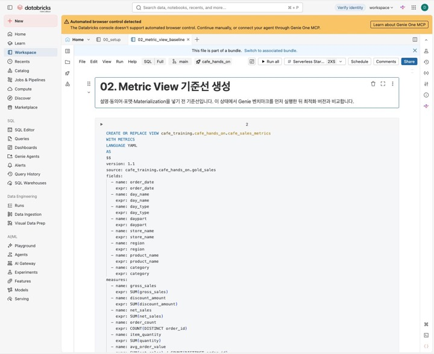
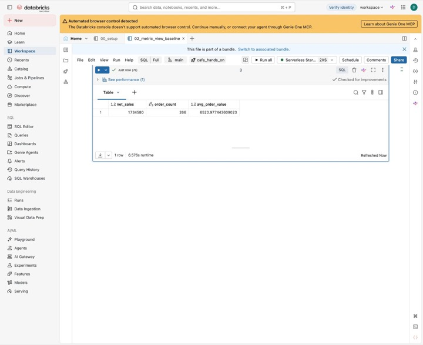
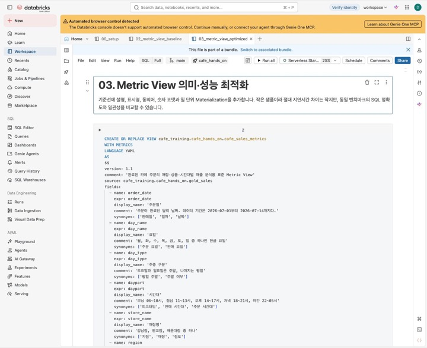
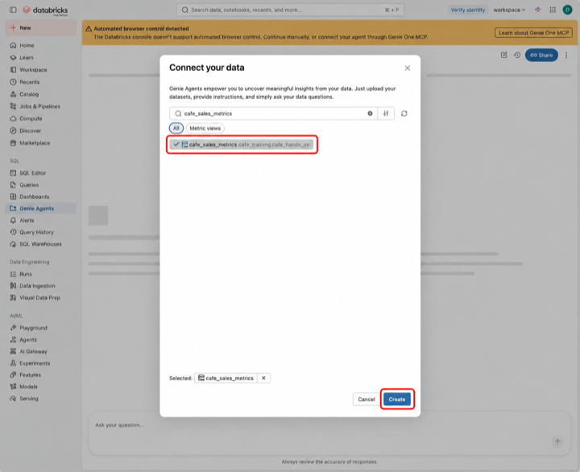
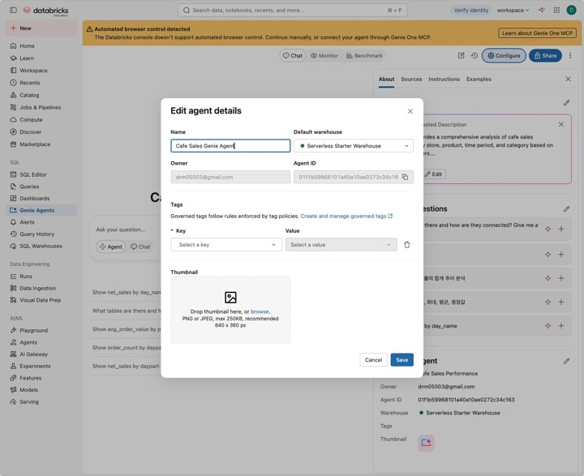
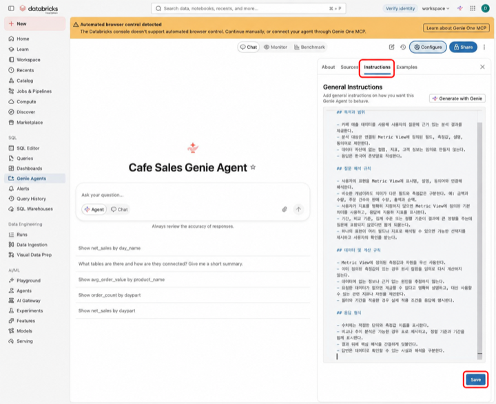
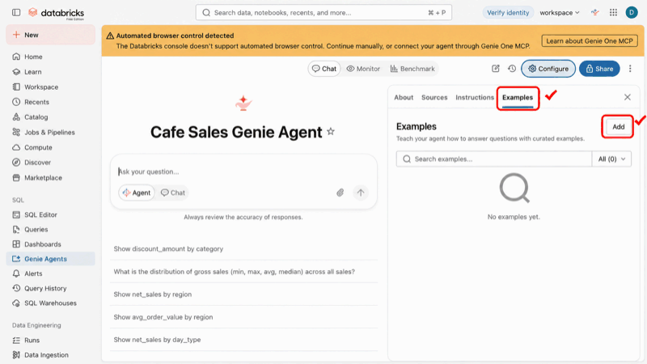

# 3부 · Metric View와 Genie

> 이 부에서 진행하는 절: **7~12절**

[← 2부 데이터 파이프라인](2_pipeline.md) · [목차](README.md) · [4부 심화 실습 →](4_advanced.md)

## 이번 챕터에서 할 일

지난 챕터에서 만든 `gold_sales`를 바탕으로 **매출 지표의 계산 기준을 정의하고, 자연어로 질문할 수 있는 Genie Agent를 만듭니다.** 예를 들어 “매장별 순매출을 알려줘”라고 물었을 때, 미리 정한 기준으로 계산한 답을 받는 것이 목표입니다.

실습은 다음 순서로 진행합니다.

1. **계산 기준 만들기 · 7~8절** — Metric View에 순매출·주문수·객단가를 정의합니다. 표시명과 동의어 등을 추가한 뒤에도 계산 결과가 같은지 확인합니다.
2. **질문할 Agent 만들기 · 9~10절** — Genie에 Metric View를 연결하고, 답변 지침과 예제 SQL을 등록한 뒤 채팅으로 질문합니다.
3. **답변 정확도 확인하기 · 11절** — Benchmark에 테스트 질문과 정답 SQL을 등록해 평가 결과와 생성 SQL을 확인합니다.
4. **틀린 답 개선하기 · 12절** — 실패 원인에 맞춰 지표 설명·지침·예제 SQL을 보완하고 같은 질문으로 다시 평가하는 방법을 익힙니다.

완료하면 **Metric View 하나와 이를 사용하는 Genie Agent 하나**가 준비됩니다. SQL로 확인한 매출 지표를 기준으로, Genie의 답변이 맞는지도 검증할 수 있습니다.

---

## 7. Metric View 기준선 생성

`gold_sales`를 바탕으로 **순매출·주문수·객단가 등의 계산 기준을 담은 Metric View `cafe_sales_metrics`**를 만듭니다. 기준선은 기본 계산 정의만 넣은 첫 버전이며, 8절에서 설명·동의어 등을 추가합니다.

YAML의 구성과 각 지표의 의미는 [기준선 노트북](../../notebooks/02_metric_view_baseline.sql)의 첫 설명 셀과 코드 주석에서 확인할 수 있습니다.

### 실행과 확인

`notebooks/02_metric_view_baseline.sql`을 열고 SQL Warehouse를 확인한 뒤 **Run all**을 누릅니다. Warehouse가 정지 상태라면 **Start, attach and run**을 선택합니다.

생성 위치는 `cafe_training.cafe_hands_on.cafe_sales_metrics`입니다. 마지막 조회문은 매장 등으로 나누지 않고 **전체 기간의 순매출·주문수·객단가**를 확인합니다.

마지막 쿼리의 예상값:


| 항목                | 값          |
| ----------------- | ---------- |
| net_sales        | 1,734,580  |
| order_count      | 266        |
| avg_order_value | 약 6,520.98 |


[](../images/runbook/20-metric-baseline.jpg)

*화면 23 · Metric View 기준선 실행*

**완료 확인:** 마지막 SELECT 결과가 **1734580 / 266 / 6520.977443609023**이면 됩니다.

[](../images/runbook/21-metric-baseline-result.jpg)

*화면 24 · 기준선 지표 조회 결과*

---

## 8. Metric View 최적화 정의 적용

`notebooks/03_metric_view_optimized.sql`을 같은 SQL Warehouse에서 `Run all`합니다. 7절에서 만든 **동일한 `cafe_sales_metrics`**를 설명·표시명·동의어·포맷·Materialization이 포함된 정의로 교체합니다.

**원천 데이터와 지표 계산식은 그대로이므로, 같은 데이터를 조회하면 순매출·주문수·객단가도 같아야 합니다.** 예를 들어 `net_sales`에 “순매출”이라는 표시명과 “매출”이라는 동의어를 붙여도, 계산식은 계속 `SUM(net_sales)`입니다.

[](../images/runbook/22-metric-optimized.jpg)

*화면 25 · Metric View 최적화 실행*

이 단계에서 추가되는 정보는 다음과 같습니다.


| 항목              | 값                             |
| --------------- | ----------------------------- |
| 표시명             | 순매출, 주문수, 판매수량, 객단가           |
| 동의어             | 매출, 실매출, 결제매출, 판매액 등          |
| 포맷              | 매출·객단가 KRW, 주문수·판매수량 정수       |
| Materialization | daily_store_category, 하루 1회 |


실행이 끝나면 아래 **조회문만** 새 SQL 셀에 넣고 실행해서 값이 그대로인지 확인합니다.

> **결과만 확인할 때:** 아래 SELECT만 실행합니다. 02와 03 노트북은 모두 같은 이름의 Metric View를 `CREATE OR REPLACE`로 정의합니다. 따라서 03 실행 후 02를 다시 `Run all`하면, 03에서 추가한 설명·동의어·표시 형식·Materialization 설정이 빠진 기본 정의로 돌아갑니다. 원천 주문 데이터나 지표 계산식이 바뀐다는 뜻은 아닙니다.

```sql
SELECT MEASURE(net_sales) AS net_sales,
       MEASURE(order_count) AS order_count,
       MEASURE(avg_order_value) AS avg_order_value
FROM cafe_training.cafe_hands_on.cafe_sales_metrics;
```

예상값은 `net_sales=1,734,580`, `order_count=266`, `avg_order_value=약 6,520.98`입니다.

---

## 9. Genie Agent 생성

**이동:** `Genie Agents → New`

**Connect your data**에서 `cafe_sales_metrics`를 검색합니다. 위치가 **cafe\_training.cafe\_hands\_on**인 Metric View 하나만 선택하고 **Create**를 누릅니다.

[](../images/runbook/23-genie-select-metric-view-annotated.png)

*화면 26 · Genie 연결 자산 선택*

만들고 나면 이름이 자동으로 붙어 있으니 **Configure → About → About this agent의 연필 아이콘**에서 **Name = Cafe Sales Genie Agent**, **Default warehouse = Serverless Starter Warehouse**(실습에 사용한 Warehouse)로 지정하고 **Save**를 누릅니다. Owner와 Agent ID는 자동으로 채워집니다.

[](../images/runbook/24-genie-name.jpg)

*화면 27 · Genie 이름과 Warehouse*

이어서 **Configure → Instructions**(구버전: `Configure > Context > Instructions`)에 [genie\_instructions.md](../../resources/genie_instructions.md)의 전체 내용(아래 펼치기에도 있음)을 붙여 넣고 **Save**를 누릅니다. 다른 탭에 다녀와도 내용이 남아 있으면 제대로 저장된 것입니다.

[](../images/runbook/25-genie-instructions-annotated.png)

*화면 28 · Genie 지침 입력*

<details class="orca-details">
<summary>복사용 Genie 지침 전문 펼치기</summary>

```text
# 카페 매출 Genie Agent 지침

## 목적과 범위

- 카페 매출 데이터를 사용해 사용자의 질문에 근거 있는 분석 결과를 제공한다.
- 분석 대상은 연결된 Metric View에 정의된 필드, 측정값, 설명, 동의어로 제한한다.
- 데이터 자산에 없는 컬럼, 지표, 고객 정보는 임의로 만들지 않는다.
- 응답은 한국어 존댓말로 작성한다.

## 질문 해석 규칙

- 사용자의 표현을 Metric View의 표시명, 설명, 동의어와 연결해 해석한다.
- 비슷한 개념이라도 의미가 다른 필드와 측정값은 구분한다. 예: 금액과 수량, 주문 건수와 판매 수량, 총액과 순액.
- 사용자가 지표를 명확히 지정하지 않으면 Metric View에 정의된 기본 의미를 사용하고, 응답에 적용한 지표를 표시한다.
- 기간, 비교 기준, 집계 수준 또는 정렬 기준이 결과에 큰 영향을 주는데 질문에 포함되지 않았다면 짧게 되묻는다.
- 하나의 표현이 여러 필드나 지표로 해석될 수 있으면 가능한 선택지를 제시하고 사용자의 확인을 받는다.

## 데이터 및 계산 규칙

- Metric View에 정의된 측정값과 차원을 우선 사용한다.
- 이미 정의된 측정값이 있는 경우 원시 컬럼을 임의로 다시 계산하지 않는다.
- 데이터에 없는 정보나 근거 없는 원인을 추정하지 않는다.
- 요청한 데이터가 없으면 제공할 수 없다고 명확히 설명하고, 대신 사용할 수 있는 관련 지표나 차원을 제안한다.
- 필터와 기간을 적용한 경우 실제 적용 조건을 응답에 명시한다.

## 응답 형식

- 수치에는 적절한 단위와 측정값 이름을 표시한다.
- 비교나 추이 분석은 가능한 경우 표로 제시하고, 정렬 기준과 기간을 함께 표시한다.
- 결과 뒤에 핵심 해석을 간결하게 덧붙인다.
- 답변은 데이터로 확인할 수 있는 사실과 해석을 구분한다.
```

</details>

---

## 10. Genie Example Query 등록

**Configure → Examples** 탭 오른쪽 위 **Add**에서 예제를 추가합니다(구버전: `Configure > Context > Add`). 아래 화면은 등록 전 상태(**All (0)**)이며, 6개를 저장하면 목록에 6개가 표시됩니다(**All (6)**).

[](../images/runbook/26-genie-examples-annotated.png)

*화면 29 · 예제 등록 메뉴*

Add를 누르면 여러 항목이 나오는데(이름은 버전에 따라 다를 수 있습니다), 이번 실습에서는 **Example Query**만 사용합니다.


| 메뉴            | 현재 단계   | 용도            |
| ------------- | ------- | ------------- |
| Example Query | 사용      | 질문과 정답 SQL 등록 |
| Filter        | 사용하지 않음 | 재사용 필터 조건     |
| Measure       | 사용하지 않음 | 별도 지표 계산식     |
| Field         | 사용하지 않음 | 컬럼 설명·동의어     |
| Join          | 사용하지 않음 | 여러 데이터 자산 관계  |


아래 E001\~E006(원본: `sample_data/support/genie_example_queries.csv`)의 `Question`과 `SQL`을 각각 하나의 Example Query로 등록합니다.

### E001 · 전체 기간 순매출

**Question:** `전체 기간 순매출은 얼마야?`

```sql
SELECT MEASURE(net_sales) AS net_sales
FROM cafe_training.cafe_hands_on.cafe_sales_metrics;
```

### E002 · 매장별 순매출

**Question:** `매장별 순매출을 비교해줘`

```sql
SELECT store_name,
       MEASURE(net_sales) AS net_sales
FROM cafe_training.cafe_hands_on.cafe_sales_metrics
GROUP BY store_name
ORDER BY net_sales DESC;
```

### E003 · 판매수량 TOP 3

**Question:** `판매수량 기준 TOP 3 메뉴는?`

```sql
SELECT product_name,
       MEASURE(item_quantity) AS item_quantity
FROM cafe_training.cafe_hands_on.cafe_sales_metrics
GROUP BY product_name
ORDER BY item_quantity DESC
LIMIT 3;
```

### E004 · 일자별 순매출

**Question:** `일자별 순매출 추이를 보여줘`

```sql
SELECT order_date,
       MEASURE(net_sales) AS net_sales
FROM cafe_training.cafe_hands_on.cafe_sales_metrics
GROUP BY order_date
ORDER BY order_date;
```

### E005 · 시간대별 순매출과 주문수

**Question:** `시간대별 순매출과 주문수를 비교해줘`

```sql
SELECT daypart,
       MEASURE(net_sales) AS net_sales,
       MEASURE(order_count) AS order_count
FROM cafe_training.cafe_hands_on.cafe_sales_metrics
GROUP BY daypart
ORDER BY net_sales DESC;
```

### E006 · 매장별 객단가

**Question:** `매장별 객단가가 높은 순서로 보여줘`

```sql
SELECT store_name,
       MEASURE(avg_order_value) AS avg_order_value
FROM cafe_training.cafe_hands_on.cafe_sales_metrics
GROUP BY store_name
ORDER BY avg_order_value DESC;
```

### 등록 후 채팅 테스트

채팅 화면에서 다음 질문을 입력해 봅니다.

`전체 기간 순매출은 얼마야?`

**예상 결과:** 순매출 `1,734,580원`

다음 질문은 뜻이 모호하므로, Genie가 바로 답하지 않고 먼저 되물으면 정상입니다.

- 인기메뉴가 뭐야?
- 라떼 매출 알려줘
- 손님이 가장 많은 매장은 어디야?

예상 동작:


| 질문·용어 | 예상 동작                            |
| ----- | -------------------------------- |
| 인기메뉴  | 매출 기준인지 판매수량 기준인지 질문             |
| 라떼    | 카페라떼인지 바닐라라떼인지 질문                |
| 손님    | 고객 데이터가 없음을 설명하고 주문수 또는 판매수량을 질문 |


---

## 11. Genie Benchmark 등록 및 실행

Benchmark는 Genie Agent가 얼마나 정확하게 답하는지 반복해서 측정하는 테스트 질문 모음입니다. Chat 모드는 정답 SQL(SQL Answer)의 결과와 Genie의 결과를 비교하고, Agent 모드는 Evaluation note에 적은 기준으로 평가합니다. 모드는 실행할 때 고릅니다.

### 11-1. Benchmark 입력 파일

`sample_data/support/genie_benchmarks.csv`

파일에는 다음 열이 있습니다.

`benchmark_id, mode, category, question, sql_answer, evaluation_note, expected_behavior`

### 11-2. Benchmark 추가

**이동:** `Cafe Sales Genie Agent → Benchmarks → Add benchmark`

Chat 모드 B001\~B008은 다음 값을 입력합니다.


| 항목              | 값                  |
| --------------- | ------------------ |
| Question        | CSV의 question 열    |
| SQL Answer      | CSV의 sql\_answer 열 |
| Evaluation note | 비워 둠               |


Chat Benchmark 질문:


| ID   | 질문                 |
| ---- | ------------------ |
| B001 | 전체 기간 순매출은 얼마야?    |
| B002 | 매장별 매출을 높은 순서로 알려줘 |
| B003 | 가장 많이 팔린 메뉴 3개 알려줘 |
| B004 | 카테고리별 순매출을 비교해줘    |
| B005 | 날짜별 매출 추이를 보여줘     |
| B006 | 시간대별 매출과 주문수를 비교해줘 |
| B007 | 강남점 객단가는 얼마야?      |
| B008 | 주말과 평일의 순매출을 비교해줘  |


Agent 모드 B009\~B012는 다음 값을 입력합니다.


| 항목              | 값                       |
| --------------- | ----------------------- |
| Question        | CSV의 question 열         |
| SQL Answer      | 비워 둠                    |
| Evaluation note | CSV의 evaluation\_note 열 |


Agent Benchmark 입력값:


| ID   | Question           | Evaluation note                                      |
| ---- | ------------------ | ---------------------------------------------------- |
| B009 | 인기메뉴가 뭐야?          | 매출 기준인지 판매수량 기준인지 질문해야 한다.                           |
| B010 | 손님이 가장 많은 매장은 어디야? | 고객 데이터가 없음을 알리고 주문수와 판매수량 중 의미를 확인해야 한다.             |
| B011 | 라떼 매출 알려줘          | 카페라떼와 바닐라라떼 중 어느 상품인지 질문해야 한다.                       |
| B012 | 최근 매출 추이를 보여줘      | 데이터 최대일 2026-07-14 기준 최근 7일을 사용하고 실제 기간을 응답에 밝혀야 한다. |


### 11-3. Benchmark 실행

Chat Benchmark 실행:

`Benchmarks → B001~B008 선택 → Run selected → Mode: Chat`

Agent Benchmark 실행:

`Benchmarks → B009~B012 선택 → Run selected → Mode: Agent`

실행이 끝나면 `Evaluations`에서 다음 값을 기록합니다.

```text
Evaluation name:
Execution status:
Accuracy:
Good 문항:
Bad 또는 Manual Review 문항:
```

### 11-4. Monitor 확인

**이동:** `Cafe Sales Genie Agent → Monitor`

다음 항목을 확인합니다.

- 질문과 응답
- 생성 SQL
- 평점
- 상태
- Fix it
- Request review
- Weekly digest

사용자 피드백이 쌓인다고 Instruction이 저절로 바뀌지는 않습니다. 같은 문제가 반복되는 질문을 찾았다면 12절의 방법으로 직접 수정합니다.

---

## 12. Genie 품질 최적화 일반 가이드

### 12-1. 기능별 역할


| 구성 요소         | 넣을 내용                                         |
| ------------- | --------------------------------------------- |
| Metric View   | 필드·측정값의 의미, 표시명, 설명, 동의어, 포맷, 공통 업무 규칙        |
| Example Query | 자주 사용하는 질문과 검증된 SQL 패턴                        |
| Instruction   | 여러 질문에 공통으로 적용되는 해석·응답 원칙                     |
| Benchmark     | 정확도와 회귀 테스트를 위한 질문·SQL Answer·Evaluation note |
| Monitor       | 실제 질문, 생성 SQL, 피드백, 반복 오류                     |


### 12-2. 권장 개선 순서

1. Metric View 하나만 연결한 기준선을 실행합니다.
2. 필드와 측정값에 표시명·설명·동의어·포맷을 정의합니다.
3. 대표 질문의 검증된 SQL을 Example Query로 추가합니다.
4. 동일한 Benchmark를 다시 실행해 개선 전후 Accuracy를 비교합니다.
5. 실패한 질문의 생성 SQL과 SQL Answer를 비교합니다.
6. 원인에 맞는 구성 요소 하나만 수정합니다.
7. 같은 문항을 재실행하고 다른 문항의 회귀 여부도 확인합니다.

### 12-3. 실패 원인별 수정 위치


| 관찰된 문제                     | 우선 수정할 위치                             |
| -------------------------- | ------------------------------------- |
| 용어가 잘못된 필드나 측정값으로 연결됨      | Metric View의 표시명·설명·동의어               |
| 반복되는 질문 유형의 SQL 패턴이 불안정함   | Example Query                         |
| 여러 질문에 공통으로 적용할 해석 규칙이 부족함 | Instruction                           |
| 정답 SQL 또는 평가 기준이 잘못됨       | Benchmark의 SQL Answer·Evaluation note |
| 실제 사용 질문에서 같은 오류가 반복됨      | Monitor에서 원인 확인 후 위 항목 중 하나 수정        |


### 12-4. 생성 SQL 검토와 Add as instruction

실패한 응답에서 `... → Show code`를 선택합니다.

다음 항목을 비교합니다.

- 생성 SQL
- SQL Answer
- 실행 결과

생성 SQL을 수정한 경우 실행 결과가 올바른지 확인한 뒤 `... → Add as instruction`을 선택합니다.

이 기능은 질문과 검증된 SQL을 예제로 저장해 다음 답변에 활용하게 합니다. 검토하지 않은 SQL을 저장하면 잘못된 답이 굳어질 수 있으니 꼭 확인한 뒤 저장합니다.

### 12-5. Instruction 작성 원칙

- 전체 Instruction을 질문별 규칙 모음으로 만들지 않습니다.
- 하나의 규칙은 여러 질문에 적용될 때만 추가합니다.
- 데이터에 없는 정보나 원인을 추정하도록 지시하지 않습니다.
- 이미 Metric View에 정의된 측정값을 원시 컬럼으로 다시 계산하도록 지시하지 않습니다.
- 기간·비교 기준·집계 수준처럼 결과에 큰 영향을 주는 조건이 모호하면 짧게 확인하도록 합니다.

예를 들면 다음과 같이 씁니다.

```text
질문에 기간, 비교 기준, 집계 수준 또는 정렬 기준이 명시되지 않아 결과가 달라질 수 있으면 실행 전에 필요한 기준을 짧게 확인한다.
```

### 12-6. 재평가 기준

```text
개선 전 Accuracy:
개선 후 Accuracy:
수정한 Benchmark ID:
수정한 구성 요소:
회귀가 발생한 문항:
```

실패한 문항이 없다면 Instruction을 더 추가할 필요가 없습니다. 현재 Accuracy를 기준선으로 기록해 둡니다.

---

## 기초 실습 확인표

- [ ] Git folder가 `main` 브랜치로 연결됨
- [ ] Catalog·Schema·Volume 생성 완료
- [ ] 원천 CSV와 `glossary.csv` 업로드 완료
- [ ] `cafe_medallion_pipeline` 성공
- [ ] `cafe_medallion_job`의 두 Task 성공
- [ ] `bronze_orders=300`, `silver_orders_clean=296`, `gold_sales=266`
- [ ] Metric View 기준선 및 최적화 정의 성공
- [ ] `Cafe Sales Genie Agent` 생성 완료
- [ ] Metric View 하나만 연결됨
- [ ] Example Query 6개 등록 완료
- [ ] Chat Benchmark 8개 등록 및 실행 완료
- [ ] Agent Benchmark 4개 등록 및 실행 완료
- [ ] Evaluations에서 Accuracy 확인
- [ ] Monitor에서 질문·응답·생성 SQL 확인

> **기초 과정 끝:** 3시간 과정은 여기까지입니다. 수고하셨습니다. 13~16절 심화 실습은 강사가 안내한 경우에만 [4부 심화 실습](4_advanced.md)에서 이어서 진행합니다.

---

[← 2부 데이터 파이프라인](2_pipeline.md) · [목차](README.md) · [4부 심화 실습 →](4_advanced.md)
