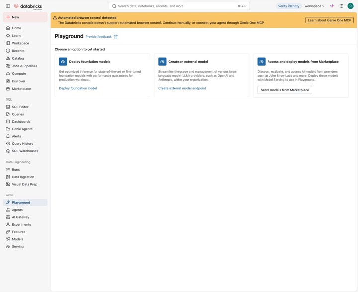

# 4부 · 심화 실습

> 이 부에서 진행하는 절: **13~16절**

[← 3부 Metric View와 Genie](3_metric_genie.md) · [목차](README.md) · [강사용 배포 →](5_instructor.md)

## 13. AI Search 용어집 구성

AI Search는 "아메" 같은 약어나 동의어, 여러 뜻을 가진 단어, 업무 규칙을 찾아 주는 용어집 역할을 합니다. 검색으로 뜻이 하나로 정해지면 Supervisor가 그 뜻을 Genie Agent에 넘겨 줍니다.

### 13-1. 고정 이름


| 항목                 | 값                                                 |
| ------------------ | ------------------------------------------------- |
| Source table       | `cafe_training.cafe_hands_on.cafe_glossary`       |
| AI Search endpoint | `cafe-ai-search-endpoint`                         |
| AI Search index    | `cafe_training.cafe_hands_on.cafe_glossary_index` |
| Primary key        | `term_id`                                         |
| Embedding source   | `search_text`                                     |
| Sync mode          | TRIGGERED                                         |
| Query type         | HYBRID                                            |
| Top results        | 3                                                 |


### 13-2. 원본 파일 확인

다음 파일이 Volume에 있어야 합니다.

```text
/Volumes/cafe_training/cafe_landing/raw/support/glossary.csv
```

용어집은 19개 행이고, `term_id`, `term`, `aliases`, `definition`, `metric_or_field`, `resolution_rule`, `example_question`, `updated_at`, `search_text` 컬럼이 있습니다.

### 13-3. 노트북 실행

Git folder에서 다음 노트북을 엽니다.

`notebooks/05_create_ai_search.py`

사용 가능한 Python Compute를 연결하고 첫 번째 셀을 실행합니다.

```python
%pip install -q --upgrade databricks-ai-search
dbutils.library.restartPython()
```

Python이 재시작되면 설치 셀은 다시 실행하지 말고 그다음 위젯 셀부터 차례로 실행합니다. Endpoint를 만든 뒤에는 13-5절에서 상태를 확인하고 나서 Index 생성 셀로 넘어갑니다.

위젯 기본값:


| 항목                 | 값                               |
| ------------------ | ------------------------------- |
| Catalog            | `cafe_training`                 |
| Schema             | `cafe_hands_on`                 |
| AI Search endpoint | `cafe-ai-search-endpoint`       |
| Embedding model    | databricks-qwen3-embedding-0-6b |


### 13-4. Delta 테이블 확인

용어집 CSV를 읽는 셀과 테이블 생성 셀을 실행합니다.

**예상 테이블:** `cafe_training.cafe_hands_on.cafe_glossary`

Catalog Explorer에서 다음을 확인합니다.


| 항목               | 값            |
| ---------------- | ------------ |
| 행 수              | 19           |
| Primary key      | `term_id`    |
| 검색 텍스트           | search\_text |
| Change Data Feed | 활성화          |


### 13-5. Endpoint와 Index 확인

Endpoint 생성 셀을 실행한 뒤 `AI Search → Endpoints → cafe-ai-search-endpoint`에서 상태를 확인합니다.

**완료 확인:** Endpoint 상태가 `ONLINE`입니다.

Endpoint가 `ONLINE`이 되면 Index 생성 셀을 실행합니다.


| 항목               | 값                                                 |
| ---------------- | ------------------------------------------------- |
| Index            | `cafe_training.cafe_hands_on.cafe_glossary_index` |
| Source           | `cafe_training.cafe_hands_on.cafe_glossary`       |
| Primary key      | `term_id`                                         |
| Embedding source | `search_text`                                     |
| Sync mode        | TRIGGERED                                         |


### 13-6. Triggered Sync와 검색 실행

Index를 만든 뒤 다음 셀을 실행합니다.

```python
index.sync()
```

Catalog Explorer에서 Index 상태가 `ONLINE`이고 Indexed rows가 19인지 확인합니다.

노트북 마지막 셀에서 Hybrid 검색을 해 봅니다.

```python
results = index.similarity_search(
    query_text="아메 매출과 피크타임을 알려줘",
    columns=["term_id", "term", "definition", "resolution_rule"],
    num_results=3,
    query_type="HYBRID",
)
display(results)
```

다음 검색어로도 바꿔 가며 실행해 봅니다.

- 라떼 매출
- 손님수
- 최근 매출
- 주말 매출

예상 검색 규칙:


| 질문·용어 | 예상 동작                     |
| ----- | ------------------------- |
| 아메    | 아메리카노                     |
| 피크타임  | 시간대별 순매출 비교               |
| 라떼    | 카페라떼 또는 바닐라라떼 중 선택 필요     |
| 손님수   | 고객 데이터 없음, 주문수 또는 판매수량 제안 |
| 최근    | 데이터 최대일 기준 직전 7일          |
| 주말    | 토요일과 일요일                  |


### 13-7. AI Search 완료 기준

- cafe\_glossary 테이블 생성
- 행 수 19개
- cafe-ai-search-endpoint 상태 ONLINE
- cafe\_glossary\_index 상태 ONLINE
- Triggered Sync 완료
- Hybrid 검색 결과 Top 3 확인
- 아메·피크타임·라떼·손님수 검색 규칙 확인

---

## 14. Databricks Apps 구성

Playground에서 확인한 Supervisor Agent를 Databricks Apps로 배포합니다. 배포한 App은 Genie Agent와 AI Search Index를 사용하고, 대화 기록(Trace)을 MLflow Experiment에 남깁니다.

### 14-0. 먼저 Playground에서 Supervisor 구성

App으로 내보내기 전에, Playground에서 Supervisor가 질문에 맞는 도구를 제대로 고르는지 먼저 확인합니다. 참고: [Supervisor 지침](../../resources/supervisor_prompt.md) · [Databricks Playground 가이드](https://docs.databricks.com/aws/en/getting-started/gen-ai-llm-agent)

Playground에 아래처럼 **Choose an option to get started**와 모델 배포 안내만 보이면 아직 사용할 모델이 없는 상태입니다. 강사가 모델 endpoint와 접근 권한을 먼저 준비해야 모델·System prompt·Tools를 입력할 수 있습니다.

[](../images/runbook/27-playground-prerequisites.jpg)

*화면 30 · Playground 사전 준비 화면*

1. 왼쪽 **AI/ML &gt; Playground**를 엽니다.
2. 강사가 지정한 모델 중 `Tools enabled` 모델을 선택합니다.
3. System prompt에 `resources/supervisor_prompt.md`의 전체 내용을 붙여 넣습니다.
4. `Tools > + Add tool`에서 Genie에 연결할 관리형 MCP 도구를 선택하고 `Cafe Sales Genie Agent`를 연결합니다. AI Search 도구에는 `cafe_training.cafe_hands_on.cafe_glossary_index`를 연결합니다. 도구 선택 화면은 Workspace마다 조금 다를 수 있습니다.
5. 아래 질문을 하나씩 새 대화에서 테스트합니다. 답변 내용뿐 아니라 어떤 도구를 어떤 순서로 불렀는지도 함께 확인합니다.


| 입력 질문              | 확인할 동작                      |
| ------------------ | --------------------------- |
| `매장별 순매출을 비교해줘`    | Genie로 매장별 매출 조회            |
| `아메 매출 알려줘`        | AI Search로 용어 확인 후 Genie 조회 |
| `라떼 매출 알려줘`        | AI Search 결과를 바탕으로 상품을 되묻기  |
| `손님 수가 가장 많은 매장은?` | 고객 데이터가 없음을 설명하고 대체 지표 제안   |


도구가 보이지 않거나 연결 오류가 나면 강사에게 권한과 기능 활성화 여부를 확인해 달라고 요청합니다. 네 질문이 모두 예상대로 동작하면 Export로 넘어갑니다. 참고로 App으로 내보내려면 Databricks Apps와 Managed MCP Servers preview가 켜져 있어야 합니다. 이 문서에서 말하는 Supervisor는 질문에 따라 두 도구를 골라 부르는 Agent를 가리킵니다.

### 14-1. Playground에서 App으로 내보내기

Playground의 Supervisor 구성 화면에서 다음을 선택합니다.

`Get code → Export to Databricks Apps`

입력값:


| 항목                | 값                                                |
| ----------------- | ------------------------------------------------ |
| App name          | `agent-cafe-supervisor`                          |
| App description   | 카페 매출 Genie와 용어집 AI Search를 연결한 Supervisor Agent |
| MLflow experiment | `cafe-supervisor-agent`                          |


`Export`가 끝나면 만들어진 App을 엽니다.

`Apps → agent-cafe-supervisor`

### 14-2. App Resource 연결

App 설정에서 `Settings → Resources`를 엽니다.

Export할 때 자동으로 추가된 리소스를 확인하고, 빠진 것이 있으면 추가합니다.


| Resource type     | 대상                                                | Resource key          | 권한          |
| ----------------- | ------------------------------------------------- | --------------------- | ----------- |
| Genie Agent       | `Cafe Sales Genie Agent`                          | `cafe_genie`          | Can run     |
| AI Search index   | `cafe_training.cafe_hands_on.cafe_glossary_index` | `cafe_glossary_index` | Can select  |
| MLflow experiment | `cafe-supervisor-agent`                           | `cafe_experiment`     | Can edit 이상 |


AI Search Index는 Workspace 버전에 따라 `AI Search index` 또는 `Vector search index`로 표시됩니다.

권한은 필요한 만큼만 줍니다. AI Search Index는 `Can select`, Genie Agent는 `Can run`이면 충분합니다. ([Databricks Apps 리소스 문서](https://docs.databricks.com/aws/en/dev-tools/databricks-apps/resources))

### 14-3. 환경 변수 확인

`resources/app.yaml.example`의 리소스 키와 App Resources의 키가 일치해야 합니다.

```yaml
env:
  - name: GENIE_SPACE_ID
    valueFrom: cafe_genie
  - name: VECTOR_SEARCH_INDEX
    valueFrom: cafe_glossary_index
  - name: MLFLOW_EXPERIMENT_ID
    valueFrom: cafe_experiment
```

화면에서는 `Genie Agent`라고 부르지만 내부 환경 변수는 여전히 `GENIE_SPACE_ID`라는 이름을 쓰는 경우가 있으니, 예제의 변수 이름은 바꾸지 않습니다.

### 14-4. App 실행과 확인

**완료 확인:** App 상태가 `Running`입니다.

App에서 다음 질문을 하나씩 입력해 봅니다.

- 매장별 순매출을 비교해줘
- 아메 매출 알려줘
- 라떼 매출 알려줘
- 손님 수가 가장 많은 매장은?

예상 흐름:


| 질문 유형  | 도구 호출 흐름                             |
| ------ | ------------------------------------ |
| 표준 질문  | Supervisor → Genie Agent             |
| 별칭 질문  | Supervisor → AI Search → Genie Agent |
| 다의어 질문 | Supervisor → AI Search → 사용자 명확화     |
| 미지원 개념 | Supervisor → AI Search → 대체 지표 안내    |


질문마다 답변과 도구 호출 순서가 위와 같은지 확인합니다.

---

## 15. MLflow Trace·평가·모니터링

MLflow Trace에는 Supervisor가 받은 질문과 답변, 모델·Genie·AI Search를 부른 기록, 걸린 시간 등이 남습니다. 개발할 때는 이 Trace를 보고 Scorer로 평가하고, 운영할 때는 같은 Scorer를 Production Monitoring에 그대로 쓸 수 있습니다. ([MLflow 공식 문서](https://docs.databricks.com/aws/en/mlflow3/genai/eval-monitor))

### 15-1. Trace 생성

14-4에서 App에 입력한 네 질문이 이미 Trace로 기록되어 있습니다. 아직 실행하지 않았다면 App에서 먼저 입력합니다. 전체 평가 질문은 `sample_data/support/agent_evaluation.csv`에 있습니다.

### 15-2. MLflow 노트북 실행

Git folder에서 다음 노트북을 엽니다.

`notebooks/06_mlflow_monitoring.py`

Python Compute를 연결하고 첫 번째 셀을 실행합니다.

```python
%pip install -q --upgrade "mlflow[databricks]>=3.4.0"
dbutils.library.restartPython()
```

Python이 재시작되면 그다음 셀부터 실행합니다.

### 15-3. MLflow Experiment 지정

위젯에 App에서 연결한 MLflow Experiment 경로를 입력합니다.

`experiment_path: /Shared/cafe-supervisor-agent`

App을 Export할 때 다른 경로를 썼다면 그 경로를 입력합니다. 노트북과 App이 같은 Experiment를 가리켜야 App의 Trace를 볼 수 있습니다.

예상 출력:

`MLflow experiment: /Shared/cafe-supervisor-agent`

### 15-4. Trace 조회

Trace 조회 셀을 실행합니다.

```python
traces = mlflow.search_traces(max_results=30)
display(traces)
```

Trace에서 다음 항목을 확인합니다.

- 입력 질문
- 최종 응답
- Supervisor 모델 호출
- Genie Agent Tool span
- AI Search Tool span
- Trace 상태
- 전체 latency
- 각 단계 latency

질문별 예상 Tool 경로:


| 질문      | Tool 경로            |
| ------- | ------------------ |
| 매장별 순매출 | genie              |
| 아메 매출   | ai\_search → genie |
| 라떼 매출   | ai\_search         |
| 손님 수    | ai\_search         |


### 15-5. 기본 Scorer 평가

평가 셀을 실행하면 다음 세 가지 Scorer로 평가합니다.

```python
from mlflow.genai.scorers import (
    RelevanceToQuery,
    Safety,
    ToolCallCorrectness,
)
```

평가 결과에서 다음 값을 확인합니다.

- RelevanceToQuery
- Safety
- ToolCallCorrectness

결과는 `evaluation.metrics`와 `evaluation.result_df`로 출력됩니다.

```python
print(evaluation.metrics)
display(evaluation.result_df)
```

`ToolCallCorrectness`는 Trace에 남은 도구 호출 기록을 보고, 알맞은 도구를 알맞은 값으로 불렀는지 평가합니다. ([MLflow ToolCallCorrectness 문서](https://mlflow.org/docs/latest/genai/eval-monitor/scorers/llm-judge/tool-call/correctness/))

### 15-6. MLflow UI 확인

Workspace 왼쪽 메뉴에서 `AI/ML → Experiments`를 선택합니다.

`/Shared/cafe-supervisor-agent` Experiment를 열고 다음 탭을 확인합니다.

- Traces
- Evaluations
- Runs

Trace 하나를 열어 입력, 출력, Tool span, latency를 살펴보고, Evaluations 탭에서는 Scorer별 결과와 실패한 질문을 확인합니다.

### 15-7. 운영 모니터링 선택 실습

이 셀은 Workspace에서 Production Monitoring Preview가 켜져 있을 때만 실행합니다.

```python
from mlflow.genai.scorers import Safety, ScorerSamplingConfig

safety_monitor = Safety().register(name="cafe_safety")
safety_monitor = safety_monitor.start(
    sampling_config=ScorerSamplingConfig(sample_rate=0.5)
)
print(safety_monitor)
```

**샘플링 비율:** `sample_rate: 0.5`

### 15-8. 완료 기준

- App 질문 4개 이상 실행
- MLflow Experiment에 Trace 생성
- Genie·AI Search Tool span 확인
- latency 확인
- RelevanceToQuery·Safety·ToolCallCorrectness 실행
- Evaluation 결과 확인
- MLflow UI에서 Trace와 Evaluation 확인
- Production Monitoring은 Preview일 때만 선택 실행

---

## 16. 최종 통합 검증

지금까지 따로 확인한 기능들이 하나로 잘 이어지는지, 즉 질문 하나가 `Supervisor → AI Search/Genie → App → MLflow`를 거쳐 제대로 처리되는지 확인합니다.

### 16-1. 데이터와 의미 계층 확인


| 항목                    | 기대값        |
| --------------------- | ----------: |
| bronze\_orders        | 300        |
| silver\_orders\_clean | 296        |
| gold\_sales           | 266        |
| net\_sales            | 1,734,580  |
| order\_count          | 266        |
| avg\_order\_value     | 약 6,520.98 |


확인 대상:

- `cafe_training.cafe_hands_on.gold_sales`
- `cafe_training.cafe_hands_on.cafe_sales_metrics`

### 16-2. Genie 상태 확인


| 항목              | 값                                                      |
| --------------- | ------------------------------------------------------ |
| Genie Agent     | Cafe Sales Genie Agent                                 |
| 연결 자산           | cafe\_training.cafe\_hands\_on.cafe\_sales\_metrics 하나 |
| Example Query   | 필수 E001~E003 등록 완료 (E004~E006은 선택)                   |
| Chat Benchmark  | 8개                                                     |
| Agent Benchmark | 4개                                                     |
| Evaluations     | 최소 1회                                                  |
| Monitor         | 질문·응답·생성 SQL 확인                                        |


### 16-3. AI Search 상태 확인


| 항목           | 값                                                             |
| ------------ | ------------------------------------------------------------- |
| Source table | `cafe_training.cafe_hands_on.cafe_glossary`                   |
| 행 수          | 19                                                            |
| Endpoint     | cafe-ai-search-endpoint / ONLINE                              |
| Index        | cafe\_training.cafe\_hands\_on.cafe\_glossary\_index / ONLINE |
| Sync         | TRIGGERED 완료                                                  |
| Query type   | HYBRID                                                        |


### 16-4. App 통합 질문 실행

App에서 다음 4개 질문을 각각 새 대화로 입력합니다.

- Q1. 매장별 순매출을 비교해줘
- Q2. 아메 매출 알려줘
- Q3. 라떼 매출 알려줘
- Q4. 손님 수가 가장 많은 매장은?

질문별 기대 결과:


| 질문  | 기대 Tool 경로        | 기대 결과                     |
| --- | ----------------- | ------------------------- |
| Q1  | Genie             | 매장별 순매출 표                 |
| Q2  | AI Search → Genie | `아메`를 `아메리카노`로 해석한 매출 결과  |
| Q3  | AI Search         | 카페라떼·바닐라라떼 중 선택 질문        |
| Q4  | AI Search         | 고객 데이터 부재와 주문수·판매수량 대안 안내 |


결과가 예상과 다르면 App의 답변 → 도구 호출 → AI Search 검색 결과 → Genie가 만든 SQL 순서로 원인을 찾아봅니다.

### 16-5. MLflow 통합 확인

MLflow Experiment에서 Q1\~Q4 Trace를 확인합니다.


| 질문  | 기대 Tool span                          |
| --- | ------------------------------------- |
| Q1  | Genie Tool span                       |
| Q2  | AI Search Tool span → Genie Tool span |
| Q3  | AI Search Tool span                   |
| Q4  | AI Search Tool span                   |


각 Trace에서 다음 값을 기록합니다.

```text
trace_id:
question:
tool_sequence:
status:
latency:
RelevanceToQuery:
Safety:
ToolCallCorrectness:
```

### 16-6. 최종 결과 기록

```text
Genie Chat Accuracy:
Genie Agent Accuracy:
Supervisor routing 결과:
MLflow Trace 개수:
RelevanceToQuery 결과:
Safety 결과:
ToolCallCorrectness 결과:
가장 먼저 개선할 항목:
```

### 16-7. 실습 완료 기준

- 데이터 행 수와 Metric View 지표 확인
- Genie Example Query·Benchmark·Monitor 확인
- AI Search Endpoint·Index ONLINE 확인
- App에서 Q1\~Q4 실행
- Q1\~Q4의 기대 Tool 경로 확인
- MLflow에서 Q1\~Q4 Trace 확인
- 세 가지 Scorer 결과 확인
- 개선할 항목 한 가지 기록

---

## 심화 실습 확인표

- [ ] `cafe_glossary` 테이블과 AI Search Index 생성 완료
- [ ] AI Search Endpoint와 Index가 `ONLINE`
- [ ] Triggered Sync와 Hybrid 검색 결과 확인
- [ ] `agent-cafe-supervisor` App 실행
- [ ] Genie·AI Search·MLflow Resource 연결
- [ ] MLflow Trace 생성 및 Tool span 확인
- [ ] RelevanceToQuery·Safety·ToolCallCorrectness 평가 완료
- [ ] 순매출 질문 정상 응답
- [ ] 다의어 질문에서 되묻는 응답 확인

---

[← 3부 Metric View와 Genie](3_metric_genie.md) · [목차](README.md) · [강사용 배포 →](5_instructor.md)
