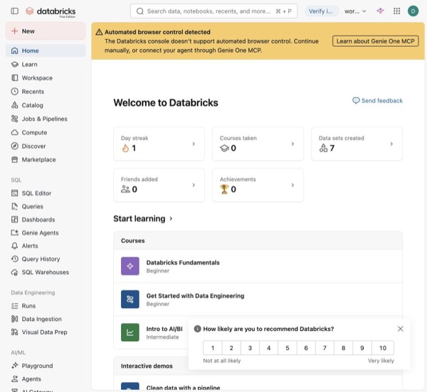

# Databricks Cafe Hands-on 실행 가이드

이 가이드를 따라 본인의 Databricks Workspace에 실습 저장소를 연결하고, 카페 매출 데이터로 메달리온 Pipeline, Lakeflow Job, Metric View, Genie Agent를 차례로 만들어 봅니다.

## 실습 시나리오

**상황.** 강남점·판교점·해운대점 3개 매장을 운영하는 카페 본사가 있습니다. 매장 POS에서 2주치(2026-07-01~07-14) 주문 기록이 CSV 파일로 나뉘어 들어옵니다. 그런데 이 데이터는 그대로 쓰기 어렵습니다.

- 파일 사이에 **중복 주문**이 있고, 수량이 0 이하인 **잘못된 행**, 비어 있는 할인율, 대소문자가 섞인 상태값이 있습니다.
- **취소 주문**을 넣느냐, **할인**을 빼느냐에 따라 "매출"이 달라집니다. 예를 들어 완료 주문만 더해도 할인 전 총매출은 1,772,800원, 할인 후 순매출은 1,734,580원입니다. 기준을 정해 두지 않으면 사람마다 다른 숫자를 말하게 됩니다.
- 현업은 "라떼 매출 알려줘", "손님이 제일 많은 매장은?"처럼 말로 묻고 싶어 합니다. 하지만 "라떼"는 카페라떼와 바닐라라떼 둘 다를 뜻할 수 있고, "손님 수"는 고객 데이터가 없어서 답할 수 없는 질문입니다.

**목표.** 흩어진 원천 CSV를 **믿을 수 있는 매출 데이터로 정리**하고, **매출 계산 기준을 한 곳에 정의**합니다. 그런 다음 누구나 **자연어로 물어봐도 같은 기준으로 정확하게 답하는 분석 Agent**를 만듭니다. 답이 정확한지 **측정하는 방법**까지 함께 익힙니다.

**Workspace에서 만드는 것.** 아래 순서대로 하나씩 만들며, 앞 단계의 결과가 다음 단계의 재료가 됩니다.

| 순서 | Workspace에서 만드는 것 | 왜 필요한가 |
|---|---|---|
| 1 | Git folder, Catalog·Schema, Volume | 실습 코드를 가져오고 원천 CSV를 올려 둘 저장 공간을 만듭니다. |
| 2 | Lakeflow Pipeline (Bronze → Silver → Gold) | 원본을 보존하면서 중복·잘못된 값을 걸러 분석용 `gold_sales`를 만듭니다. |
| 3 | Lakeflow Job | Pipeline 실행과 행 수 검증을 한 번에 묶어, 매번 같은 방식으로 돌릴 수 있게 합니다. |
| 4 | Metric View | "순매출", "주문수", "객단가"를 어떻게 계산하는지 한 곳에 정해 둡니다. |
| 5 | Genie Agent + Benchmark | 자연어 질문에 SQL로 답하는 Agent를 만들고, 테스트 질문으로 정확도를 측정합니다. |
| 6 | (심화) AI Search 용어집, Supervisor App, MLflow | 줄임말·다의어를 용어집으로 해석하고, 앱으로 제공하며, 답변 품질을 기록·평가합니다. |

실습을 마치면 원천 파일에서 자연어 분석 Agent까지 이어지는 흐름을 직접 한 번 만들어 보게 됩니다. 이 흐름은 실제 프로젝트에서도 같은 순서로 반복됩니다.

## 처음 실습하는 분께

이 페이지에서 이름 규칙과 사전 조건을 먼저 확인한 뒤, 아래 1~4부를 순서대로 진행합니다. 단계마다 예상 결과가 나왔는지 확인한 뒤 다음으로 넘어갑니다. 샘플 데이터의 기간은 **2026-07-01\~2026-07-14**입니다.

| 부 | 절 | 하는 일 | 완료하면 보이는 결과 |
|---|---|---|---|
| [1부 환경 준비](1_setup.md) | 2~4절 | 실습 코드와 CSV 준비 | 개인 Git folder와 CSV 6개가 들어 있는 Volume |
| [2부 데이터 파이프라인](2_pipeline.md) | 5~6절 | 데이터 정리 및 실행 자동화 | Bronze 300행 → Silver 296행 → Gold 266행 |
| [3부 Metric View와 Genie](3_metric_genie.md) | 7~12절 | 매출 계산 기준 정의, 자연어 분석과 답변 평가 | 순매출 1,734,580원, Genie 답변, Benchmark 결과 |
| [4부 심화 실습](4_advanced.md) | 13~16절 | 용어 검색과 Agent 앱 연결 | AI Search, Supervisor, App, MLflow Trace |

전체를 모두 진행하면 약 5시간 15분이 걸립니다. 3시간 기초 과정은 12절까지 진행하고, 13\~16절은 심화 실습으로 따로 다룹니다. 강사가 안내하는 범위까지 진행합니다.

### 빠른 이동

| 구간                  | 바로 가기                                                                                                              |
| ------------------- | ------------------------------------------------------------------------------------------------------------------ |
| 환경 준비               | [네이밍 규칙](#0-네이밍-규칙) · [사전 조건](#1-사전-조건) · [저장소 받기](1_setup.md#2-github-저장소를-git-folder로-받기) · [Catalog 준비](1_setup.md#3-catalog-schema-volume-준비) · [CSV 업로드](1_setup.md#4-csv를-volume에-업로드)               |
| 데이터 파이프라인           | [Pipeline](2_pipeline.md#5-lakeflow-pipeline-생성) · [Job과 검증](2_pipeline.md#6-lakeflow-job-생성)                                                                           |
| Metric View · Genie | [기준선](3_metric_genie.md#7-metric-view-기준선-생성) · [최적화](3_metric_genie.md#8-metric-view-최적화-정의-적용) · [Genie 생성](3_metric_genie.md#9-genie-agent-생성) · [예제](3_metric_genie.md#10-genie-example-query-등록) · [Benchmark](3_metric_genie.md#11-genie-benchmark-등록-및-실행) · [품질 개선](3_metric_genie.md#12-genie-품질-최적화-일반-가이드) |
| 심화 실습               | [AI Search](4_advanced.md#13-ai-search-용어집-구성) · [Apps](4_advanced.md#14-databricks-apps-구성) · [MLflow](4_advanced.md#15-mlflow-trace평가모니터링) · [통합 검증](4_advanced.md#16-최종-통합-검증)                                  |
| 마무리                 | [강사용 배포](5_instructor.md#17-github-반영-및-참가자-배포) · [기초 확인표](3_metric_genie.md#기초-실습-확인표) · [심화 확인표](4_advanced.md#심화-실습-확인표)                                                                            |

### 화면과 경로 읽는 법

아래는 Databricks Free Edition의 홈 화면입니다(2026-09-21 기준).

실습에서는 왼쪽 메뉴의 Workspace, Catalog, Jobs &amp; Pipelines, Genie Agents, SQL Warehouses, Playground를 주로 사용합니다.

*화면 1 · 실습에서 사용할 홈 화면*

> **화면 안내:** 그림은 Databricks Free Edition에서 직접 촬영한 화면입니다. 캡처에 보이는 계정 이메일과 리소스 ID는 촬영할 때의 값이니, 실습은 본인 계정에서 진행하시면 됩니다. 버튼 이름과 위치는 Workspace 버전에 따라 조금 다를 수 있습니다. 그림을 클릭하면 원래 크기로 볼 수 있습니다. 

- **Workspace**는 코드·노트북을 여는 곳입니다. **Catalog Explorer**는 테이블·Metric View·Volume을 확인하는 곳입니다.
- **Catalog → Schema → Table/Volume** 순으로 데이터가 정리됩니다. `cafe_training.cafe_hands_on.gold_sales`는 Catalog, Schema, Table 이름을 점으로 연결한 것입니다.
- `/Workspace/...`는 실습 코드 경로이고, `/Volumes/...`는 업로드한 데이터 파일 경로입니다. 두 경로를 혼동하지 않도록 주의합니다.
- `<사용자 이메일>`은 본인의 Databricks 로그인 이메일로 바꿔 입력합니다. 꺾쇠괄호(`< >`)는 빼고 입력합니다.
- **SQL Warehouse**는 SQL을 실행하는 컴퓨팅 자원입니다. Python 노트북에는 Python 실행이 가능한 Compute를 연결합니다.
- **Pipeline**은 Bronze·Silver·Gold 데이터를 만드는 처리 흐름이고, **Job**은 Pipeline 실행과 검증 작업의 순서를 관리합니다.

### 실행할 파일 구분

| 파일                                                                            | 실행 위치와 방법                                     |
| ----------------------------------------------------------------------------- | --------------------------------------------- |
| `00_setup.sql`, `02_metric_view_baseline.sql`, `03_metric_view_optimized.sql` | Workspace 노트북에서 SQL Warehouse를 선택하고 `Run all` |
| `01_cafe_medallion_pipeline.sql`                                              | 5절에서 Pipeline 소스로 등록하고 Pipeline 실행            |
| `04_pipeline_validate.sql`                                                    | 6절에서 Job의 SQL File task로 등록                   |
| `05_create_ai_search.py`, `06_mlflow_monitoring.py`                           | Python Compute를 연결하고 안내된 셀 순서대로 실행            |

> **오류가 나면:** 어떤 파일·셀에서 어떤 오류 메시지가 나왔는지, 어떤 Compute를 선택했는지 먼저 확인합니다. 앞 단계가 실패한 상태에서는 다음 단계로 넘어가지 말고 강사에게 화면을 보여 주시기 바랍니다.

---

## 0. 네이밍 규칙

| 대상                | 이름 또는 값                                              |
| ----------------- | ---------------------------------------------------- |
| GitHub repository | `https://github.com/yisakh843/dbx-cafe-hands-on.git` |
| Git branch        | `main`                                               |
| Git folder        | `dbx-cafe-hands-on`                                  |
| Catalog           | `cafe_training`                                      |
| Landing Schema    | `cafe_landing`                                       |
| Analytics Schema  | `cafe_hands_on`                                      |
| Volume            | `cafe_training.cafe_landing.raw`                     |
| Pipeline          | `cafe_medallion_pipeline`                            |
| Job               | `cafe_medallion_job`                                 |
| Pipeline task     | `run_medallion_pipeline`                             |
| Validation task   | `validate_pipeline`                                  |
| Metric View       | `cafe_training.cafe_hands_on.cafe_sales_metrics`     |
| Genie Agent       | `Cafe Sales Genie Agent`                             |

---

## 1. 사전 조건

교육 전에 **본인 계정으로 Databricks Free Edition에 가입하고 Workspace에 로그인**해 둡니다. 실습 객체는 각자의 Workspace에 만들기 때문에, 모두 0절의 이름(`cafe_training` 등)을 똑같이 사용하면 됩니다.

본인 Workspace에서 다음 기능과 권한을 사용할 수 있어야 합니다.

- Unity Catalog 사용
- `cafe_training`에 대한 `USE CATALOG`
- Schema 생성 권한
- Volume 생성·업로드 권한
- SQL Warehouse 사용 권한
- Serverless Lakeflow Pipeline 사용 권한
- Gold 테이블 `SELECT`
- `cafe_hands_on` Schema `CREATE TABLE`
- Genie Agent 생성·편집 권한

Catalog는 3절의 setup 노트북에서 만듭니다. 만들거나 실행하다가 실패하면 본인의 Free Edition Workspace에 로그인되어 있는지 확인하고, 오류 메시지를 강사에게 보여 주시기 바랍니다. 13\~16절 심화 실습은 강사가 Free Edition에서 필요한 기능과 모델을 쓸 수 있는지 미리 확인한 뒤 진행합니다.

---

준비가 끝났으면 [1부 환경 준비 →](1_setup.md)로 넘어갑니다.
